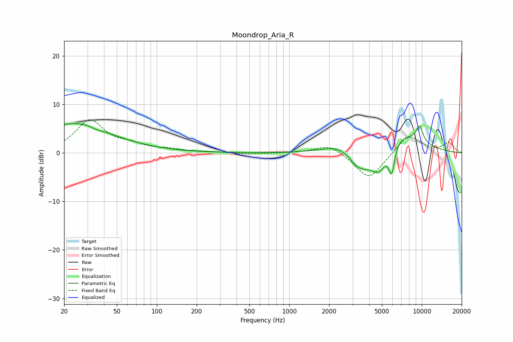

# Moondrop_Aria_R
See [usage instructions](https://github.com/jaakkopasanen/AutoEq#usage) for more options and info.

### Parametric EQs
Apply preamp of -6.2 dB when using parametric equalizer.

|   # | Type    |   Fc (Hz) |    Q |   Gain (dB) |
|-----|---------|-----------|------|-------------|
|   1 | Peaking |        20 | 0.37 |         5   |
|   2 | Peaking |        27 | 1.02 |         1.3 |
|   3 | Peaking |        36 | 5.66 |        -3   |
|   4 | Peaking |        36 | 5.86 |         2.7 |
|   5 | Peaking |      2411 | 1.24 |         1.9 |
|   6 | Peaking |      3390 | 1.58 |        -4.4 |
|   7 | Peaking |      4749 | 2.02 |        -5.8 |
|   8 | Peaking |      5928 | 6    |        -5.8 |
|   9 | Peaking |      6321 | 0.79 |         5.1 |
|  10 | Peaking |      9607 | 4.71 |         3.3 |

### Fixed Band EQs
When using fixed band (also called graphic) equalizer, apply preamp of **-6.9 dB** (if available) and set gains manually with these parameters.

|   # | Type    |   Fc (Hz) |    Q |   Gain (dB) |
|-----|---------|-----------|------|-------------|
|   1 | Peaking |        31 | 1.41 |         6.6 |
|   2 | Peaking |        62 | 1.41 |         1.3 |
|   3 | Peaking |       125 | 1.41 |         0.5 |
|   4 | Peaking |       250 | 1.41 |         0.2 |
|   5 | Peaking |       500 | 1.41 |        -0.2 |
|   6 | Peaking |      1000 | 1.41 |        -0   |
|   7 | Peaking |      2000 | 1.41 |         1.9 |
|   8 | Peaking |      4000 | 1.41 |        -5.6 |
|   9 | Peaking |      8000 | 1.41 |         3.9 |
|  10 | Peaking |     16000 | 1.41 |         2   |

### Graphs

