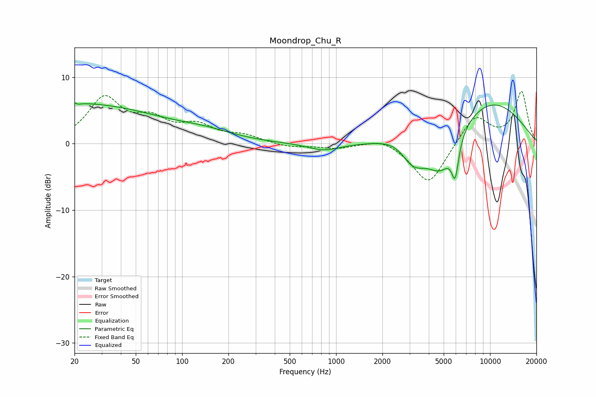

# Moondrop_Chu_R
See [usage instructions](https://github.com/jaakkopasanen/AutoEq#usage) for more options and info.

### Parametric EQs
Apply preamp of -6.3 dB when using parametric equalizer.

|   # | Type    |   Fc (Hz) |    Q |   Gain (dB) |
|-----|---------|-----------|------|-------------|
|   1 | Peaking |        20 | 0.24 |         6   |
|   2 | Peaking |        20 | 5.72 |         2.6 |
|   3 | Peaking |        20 | 5.92 |        -2.6 |
|   4 | Peaking |       145 | 0.78 |         1   |
|   5 | Peaking |       834 | 1.33 |        -1.1 |
|   6 | Peaking |      2614 | 1.29 |         1.4 |
|   7 | Peaking |      3147 | 1.7  |        -4.1 |
|   8 | Peaking |      4820 | 1.34 |        -6.8 |
|   9 | Peaking |      5935 | 6    |        -5.2 |
|  10 | Peaking |      9428 | 0.44 |         6.8 |

### Fixed Band EQs
When using fixed band (also called graphic) equalizer, apply preamp of **-8.0 dB** (if available) and set gains manually with these parameters.

|   # | Type    |   Fc (Hz) |    Q |   Gain (dB) |
|-----|---------|-----------|------|-------------|
|   1 | Peaking |        31 | 1.41 |         6.6 |
|   2 | Peaking |        62 | 1.41 |         3   |
|   3 | Peaking |       125 | 1.41 |         2.4 |
|   4 | Peaking |       250 | 1.41 |         1.1 |
|   5 | Peaking |       500 | 1.41 |        -0.6 |
|   6 | Peaking |      1000 | 1.41 |        -0.7 |
|   7 | Peaking |      2000 | 1.41 |         1   |
|   8 | Peaking |      4000 | 1.41 |        -6.3 |
|   9 | Peaking |      8000 | 1.41 |         4.4 |
|  10 | Peaking |     16000 | 1.41 |         7.7 |

### Graphs

