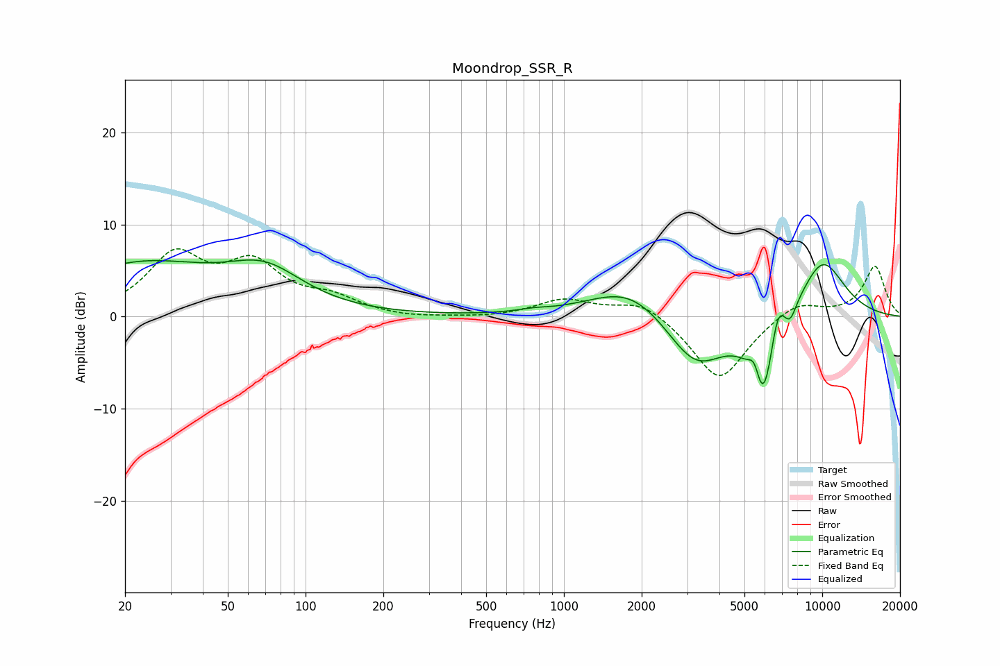

# Moondrop_SSR_R
See [usage instructions](https://github.com/jaakkopasanen/AutoEq#usage) for more options and info.

### Parametric EQs
Apply preamp of -6.3 dB when using parametric equalizer.

|   # | Type    |   Fc (Hz) |    Q |   Gain (dB) |
|-----|---------|-----------|------|-------------|
|   1 | Peaking |        23 | 0.48 |         5.5 |
|   2 | Peaking |        70 | 0.95 |         3.9 |
|   3 | Peaking |       754 | 2.52 |         0.3 |
|   4 | Peaking |      1826 | 0.88 |         3.8 |
|   5 | Peaking |      3225 | 1.18 |        -6.1 |
|   6 | Peaking |      5472 | 6    |         2.7 |
|   7 | Peaking |      5890 | 2.8  |       -10.2 |
|   8 | Peaking |      6721 | 4.69 |         4.1 |
|   9 | Peaking |      7513 | 5.99 |        -1.5 |
|  10 | Peaking |     10000 | 1.31 |         6.5 |

### Fixed Band EQs
When using fixed band (also called graphic) equalizer, apply preamp of **-7.5 dB** (if available) and set gains manually with these parameters.

|   # | Type    |   Fc (Hz) |    Q |   Gain (dB) |
|-----|---------|-----------|------|-------------|
|   1 | Peaking |        31 | 1.41 |         6.3 |
|   2 | Peaking |        62 | 1.41 |         5.1 |
|   3 | Peaking |       125 | 1.41 |         1.7 |
|   4 | Peaking |       250 | 1.41 |        -0.3 |
|   5 | Peaking |       500 | 1.41 |        -0.2 |
|   6 | Peaking |      1000 | 1.41 |         1.8 |
|   7 | Peaking |      2000 | 1.41 |         1.9 |
|   8 | Peaking |      4000 | 1.41 |        -7.1 |
|   9 | Peaking |      8000 | 1.41 |         1.8 |
|  10 | Peaking |     16000 | 1.41 |         5.5 |

### Graphs

