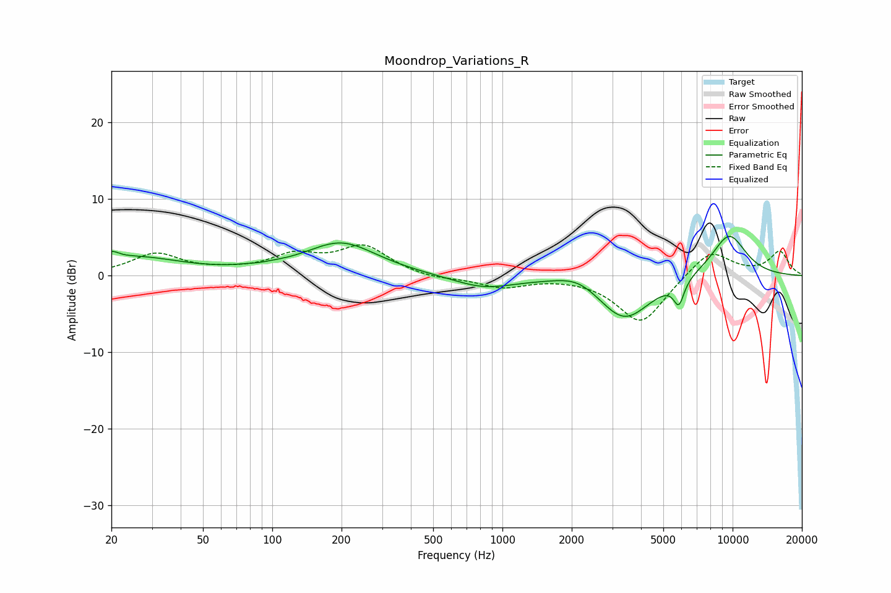

# Moondrop_Variations_R
See [usage instructions](https://github.com/jaakkopasanen/AutoEq#usage) for more options and info.

### Parametric EQs
Apply preamp of -5.2 dB when using parametric equalizer.

|   # | Type    |   Fc (Hz) |    Q |   Gain (dB) |
|-----|---------|-----------|------|-------------|
|   1 | Peaking |        20 | 4.92 |         0.9 |
|   2 | Peaking |        25 | 0.67 |         2.3 |
|   3 | Peaking |        89 | 2.61 |        -0.8 |
|   4 | Peaking |        89 | 2.17 |         1   |
|   5 | Peaking |       199 | 0.91 |         4.2 |
|   6 | Peaking |       829 | 1.05 |        -1.6 |
|   7 | Peaking |      2140 | 1.48 |         1.5 |
|   8 | Peaking |      3381 | 1.21 |        -5.9 |
|   9 | Peaking |      5843 | 6    |        -3.1 |
|  10 | Peaking |      9642 | 1.59 |         5.6 |

### Fixed Band EQs
When using fixed band (also called graphic) equalizer, apply preamp of **-4.1 dB** (if available) and set gains manually with these parameters.

|   # | Type    |   Fc (Hz) |    Q |   Gain (dB) |
|-----|---------|-----------|------|-------------|
|   1 | Peaking |        31 | 1.41 |         2.8 |
|   2 | Peaking |        62 | 1.41 |         0.4 |
|   3 | Peaking |       125 | 1.41 |         2.4 |
|   4 | Peaking |       250 | 1.41 |         3.7 |
|   5 | Peaking |       500 | 1.41 |        -0.5 |
|   6 | Peaking |      1000 | 1.41 |        -1.5 |
|   7 | Peaking |      2000 | 1.41 |        -0   |
|   8 | Peaking |      4000 | 1.41 |        -6.3 |
|   9 | Peaking |      8000 | 1.41 |         3.5 |
|  10 | Peaking |     16000 | 1.41 |         3.1 |

### Graphs

