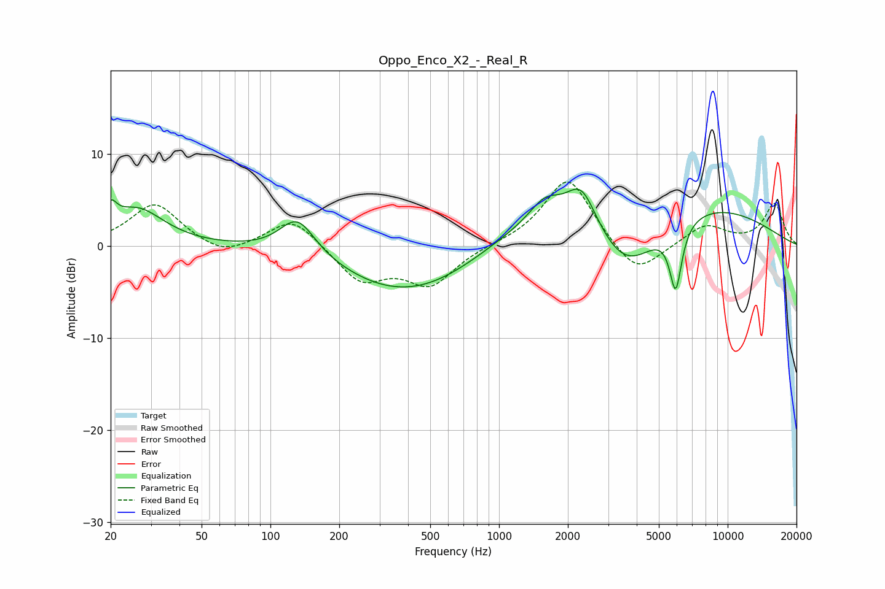

# Oppo_Enco_X2_-_Real_R
See [usage instructions](https://github.com/jaakkopasanen/AutoEq#usage) for more options and info.

### Parametric EQs
Apply preamp of -6.3 dB when using parametric equalizer.

|   # | Type    |   Fc (Hz) |    Q |   Gain (dB) |
|-----|---------|-----------|------|-------------|
|   1 | Peaking |        20 | 5.44 |         2.2 |
|   2 | Peaking |        26 | 1.21 |         4   |
|   3 | Peaking |       131 | 1.81 |         4.1 |
|   4 | Peaking |       291 | 0.79 |        -0.8 |
|   5 | Peaking |       480 | 0.47 |        -5.4 |
|   6 | Peaking |      1588 | 2.09 |         2.3 |
|   7 | Peaking |      2296 | 2.13 |         4.6 |
|   8 | Peaking |      3599 | 0.79 |        -9.7 |
|   9 | Peaking |      3674 | 0.25 |         8.3 |
|  10 | Peaking |      5924 | 5.16 |        -7.1 |

### Fixed Band EQs
When using fixed band (also called graphic) equalizer, apply preamp of **-7.1 dB** (if available) and set gains manually with these parameters.

|   # | Type    |   Fc (Hz) |    Q |   Gain (dB) |
|-----|---------|-----------|------|-------------|
|   1 | Peaking |        31 | 1.41 |         4.6 |
|   2 | Peaking |        62 | 1.41 |        -1.4 |
|   3 | Peaking |       125 | 1.41 |         3.3 |
|   4 | Peaking |       250 | 1.41 |        -3.8 |
|   5 | Peaking |       500 | 1.41 |        -4.1 |
|   6 | Peaking |      1000 | 1.41 |         0.1 |
|   7 | Peaking |      2000 | 1.41 |         7.7 |
|   8 | Peaking |      4000 | 1.41 |        -3.6 |
|   9 | Peaking |      8000 | 1.41 |         2.3 |
|  10 | Peaking |     16000 | 1.41 |         4.6 |

### Graphs

