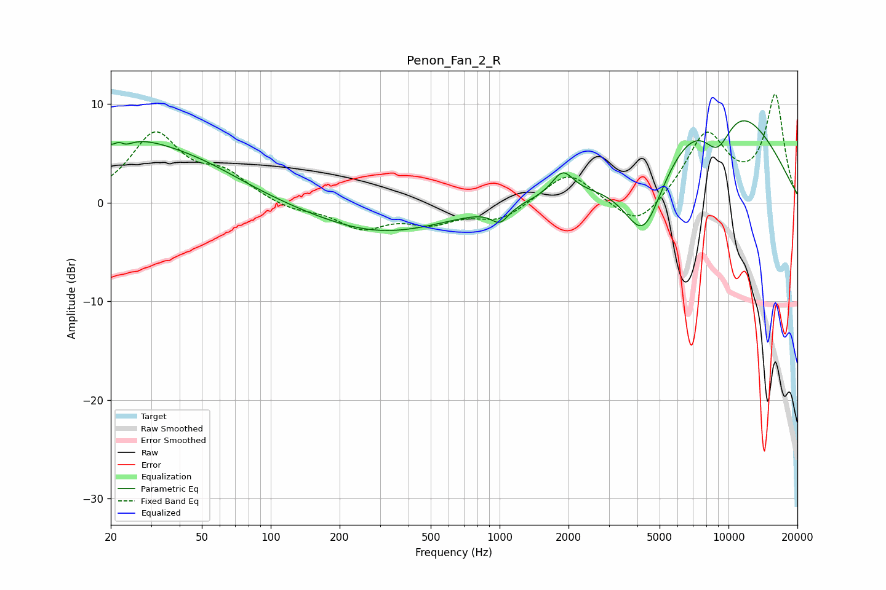

# Penon_Fan_2_R
See [usage instructions](https://github.com/jaakkopasanen/AutoEq#usage) for more options and info.

### Parametric EQs
Apply preamp of -8.4 dB when using parametric equalizer.

|   # | Type    |   Fc (Hz) |    Q |   Gain (dB) |
|-----|---------|-----------|------|-------------|
|   1 | Peaking |        21 | 0.54 |         6   |
|   2 | Peaking |        22 | 5.83 |         1.7 |
|   3 | Peaking |        22 | 4.03 |        -2.2 |
|   4 | Peaking |        51 | 0.66 |         1.8 |
|   5 | Peaking |       306 | 0.48 |        -3.1 |
|   6 | Peaking |      1005 | 3.71 |        -1.5 |
|   7 | Peaking |      1886 | 3.02 |         2.4 |
|   8 | Peaking |      4260 | 1.52 |        -8.3 |
|   9 | Peaking |      8953 | 1.8  |        -5.2 |
|  10 | Peaking |      9145 | 0.44 |        11.8 |

### Fixed Band EQs
When using fixed band (also called graphic) equalizer, apply preamp of **-11.1 dB** (if available) and set gains manually with these parameters.

|   # | Type    |   Fc (Hz) |    Q |   Gain (dB) |
|-----|---------|-----------|------|-------------|
|   1 | Peaking |        31 | 1.41 |         6.8 |
|   2 | Peaking |        62 | 1.41 |         2.5 |
|   3 | Peaking |       125 | 1.41 |        -0.8 |
|   4 | Peaking |       250 | 1.41 |        -2.4 |
|   5 | Peaking |       500 | 1.41 |        -1.8 |
|   6 | Peaking |      1000 | 1.41 |        -1.7 |
|   7 | Peaking |      2000 | 1.41 |         3.3 |
|   8 | Peaking |      4000 | 1.41 |        -3   |
|   9 | Peaking |      8000 | 1.41 |         6.8 |
|  10 | Peaking |     16000 | 1.41 |        10.7 |

### Graphs

