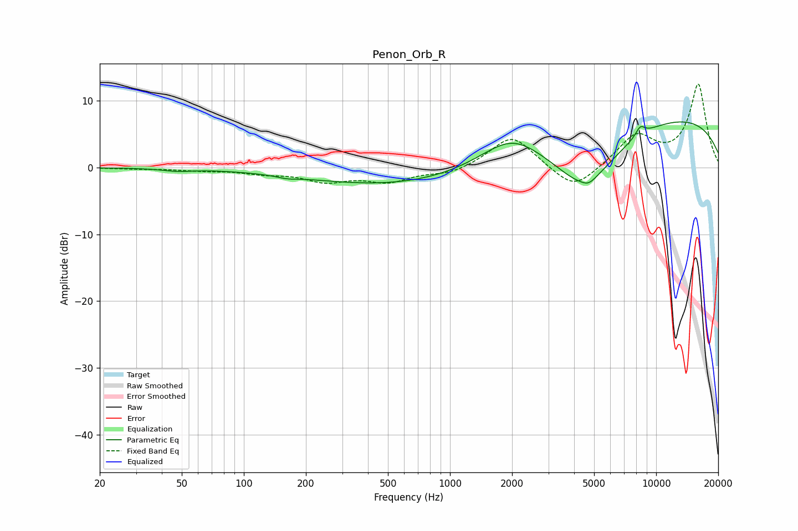

# Penon_Orb_R
See [usage instructions](https://github.com/jaakkopasanen/AutoEq#usage) for more options and info.

### Parametric EQs
Apply preamp of -6.9 dB when using parametric equalizer.

|   # | Type    |   Fc (Hz) |    Q |   Gain (dB) |
|-----|---------|-----------|------|-------------|
|   1 | Peaking |        48 | 2.03 |        -0.4 |
|   2 | Peaking |       162 | 3.03 |        -0.3 |
|   3 | Peaking |       301 | 0.44 |        -1.4 |
|   4 | Peaking |       772 | 0.45 |        -1.8 |
|   5 | Peaking |      1988 | 0.98 |         4   |
|   6 | Peaking |      4518 | 0.83 |        -9.1 |
|   7 | Peaking |      4705 | 4.45 |        -0.6 |
|   8 | Peaking |      8386 | 5.47 |         1.5 |
|   9 | Peaking |      8649 | 5.86 |        -0.1 |
|  10 | Peaking |      9766 | 0.21 |         8.1 |

### Fixed Band EQs
When using fixed band (also called graphic) equalizer, apply preamp of **-12.6 dB** (if available) and set gains manually with these parameters.

|   # | Type    |   Fc (Hz) |    Q |   Gain (dB) |
|-----|---------|-----------|------|-------------|
|   1 | Peaking |        31 | 1.41 |        -0.2 |
|   2 | Peaking |        62 | 1.41 |        -0.4 |
|   3 | Peaking |       125 | 1.41 |        -0.7 |
|   4 | Peaking |       250 | 1.41 |        -1.9 |
|   5 | Peaking |       500 | 1.41 |        -1.9 |
|   6 | Peaking |      1000 | 1.41 |        -1   |
|   7 | Peaking |      2000 | 1.41 |         4.9 |
|   8 | Peaking |      4000 | 1.41 |        -3.7 |
|   9 | Peaking |      8000 | 1.41 |         4.7 |
|  10 | Peaking |     16000 | 1.41 |        12.4 |

### Graphs

