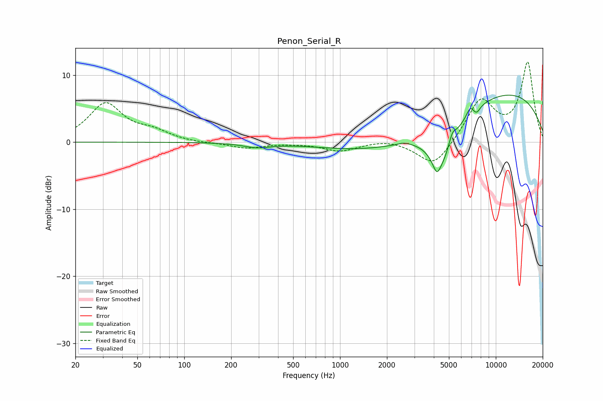

# Penon_Serial_R
See [usage instructions](https://github.com/jaakkopasanen/AutoEq#usage) for more options and info.

### Parametric EQs
Apply preamp of -7.1 dB when using parametric equalizer.

|   # | Type    |   Fc (Hz) |    Q |   Gain (dB) |
|-----|---------|-----------|------|-------------|
|   1 | Peaking |       292 | 1.66 |        -0.7 |
|   2 | Peaking |       349 | 2.08 |        -0   |
|   3 | Peaking |      2582 | 4.12 |         0.3 |
|   4 | Peaking |      2701 | 0.33 |        -2.6 |
|   5 | Peaking |      4180 | 5.88 |        -1.9 |
|   6 | Peaking |      4476 | 1.64 |        -6.3 |
|   7 | Peaking |      5257 | 6    |         1.7 |
|   8 | Peaking |      6844 | 6    |         1.2 |
|   9 | Peaking |      7524 | 5.97 |        -0.9 |
|  10 | Peaking |     10000 | 0.26 |         8   |

### Fixed Band EQs
When using fixed band (also called graphic) equalizer, apply preamp of **-12.0 dB** (if available) and set gains manually with these parameters.

|   # | Type    |   Fc (Hz) |    Q |   Gain (dB) |
|-----|---------|-----------|------|-------------|
|   1 | Peaking |        31 | 1.41 |         5.7 |
|   2 | Peaking |        62 | 1.41 |         1.3 |
|   3 | Peaking |       125 | 1.41 |        -0.2 |
|   4 | Peaking |       250 | 1.41 |        -0.9 |
|   5 | Peaking |       500 | 1.41 |        -0.1 |
|   6 | Peaking |      1000 | 1.41 |        -1.3 |
|   7 | Peaking |      2000 | 1.41 |         0.5 |
|   8 | Peaking |      4000 | 1.41 |        -3.9 |
|   9 | Peaking |      8000 | 1.41 |         6.2 |
|  10 | Peaking |     16000 | 1.41 |        11.7 |

### Graphs

