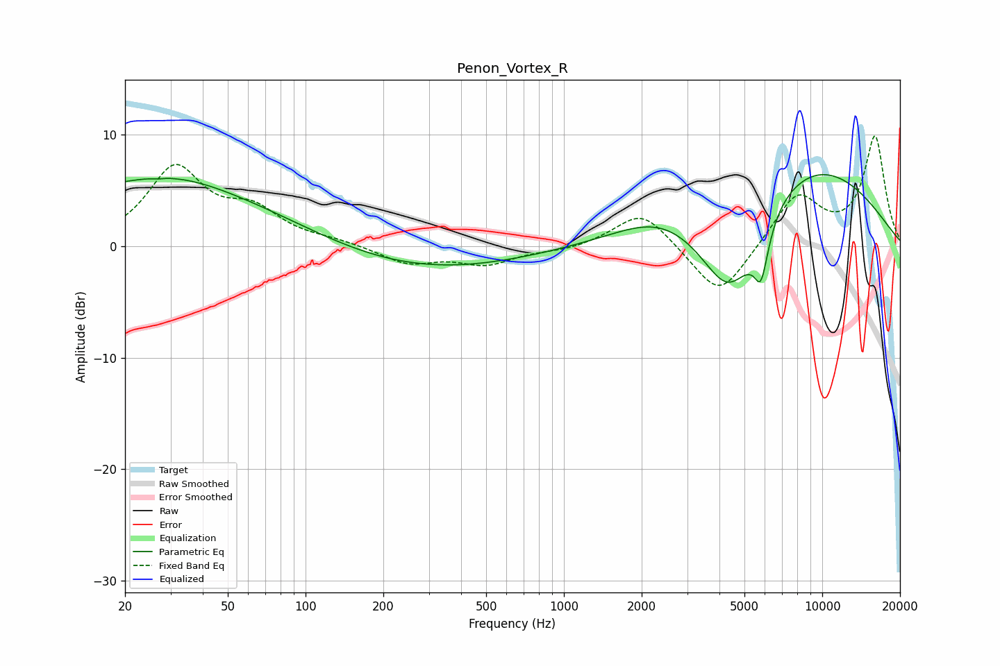

# Penon_Vortex_R
See [usage instructions](https://github.com/jaakkopasanen/AutoEq#usage) for more options and info.

### Parametric EQs
Apply preamp of -6.5 dB when using parametric equalizer.

|   # | Type    |   Fc (Hz) |    Q |   Gain (dB) |
|-----|---------|-----------|------|-------------|
|   1 | Peaking |        25 | 0.24 |         5   |
|   2 | Peaking |        28 | 5.93 |        -2.5 |
|   3 | Peaking |        28 | 5.99 |         2.5 |
|   4 | Peaking |        31 | 0.7  |         1.4 |
|   5 | Peaking |       272 | 0.36 |        -2.3 |
|   6 | Peaking |      2336 | 0.84 |         1.8 |
|   7 | Peaking |      4363 | 1.15 |        -9.2 |
|   8 | Peaking |      5601 | 5.98 |         1.5 |
|   9 | Peaking |      5739 | 4.65 |        -6.1 |
|  10 | Peaking |      8201 | 0.38 |         8.1 |

### Fixed Band EQs
When using fixed band (also called graphic) equalizer, apply preamp of **-10.0 dB** (if available) and set gains manually with these parameters.

|   # | Type    |   Fc (Hz) |    Q |   Gain (dB) |
|-----|---------|-----------|------|-------------|
|   1 | Peaking |        31 | 1.41 |         6.8 |
|   2 | Peaking |        62 | 1.41 |         2.8 |
|   3 | Peaking |       125 | 1.41 |         0.4 |
|   4 | Peaking |       250 | 1.41 |        -1.5 |
|   5 | Peaking |       500 | 1.41 |        -1.5 |
|   6 | Peaking |      1000 | 1.41 |        -0.4 |
|   7 | Peaking |      2000 | 1.41 |         3.3 |
|   8 | Peaking |      4000 | 1.41 |        -4.8 |
|   9 | Peaking |      8000 | 1.41 |         4.6 |
|  10 | Peaking |     16000 | 1.41 |         9.8 |

### Graphs

