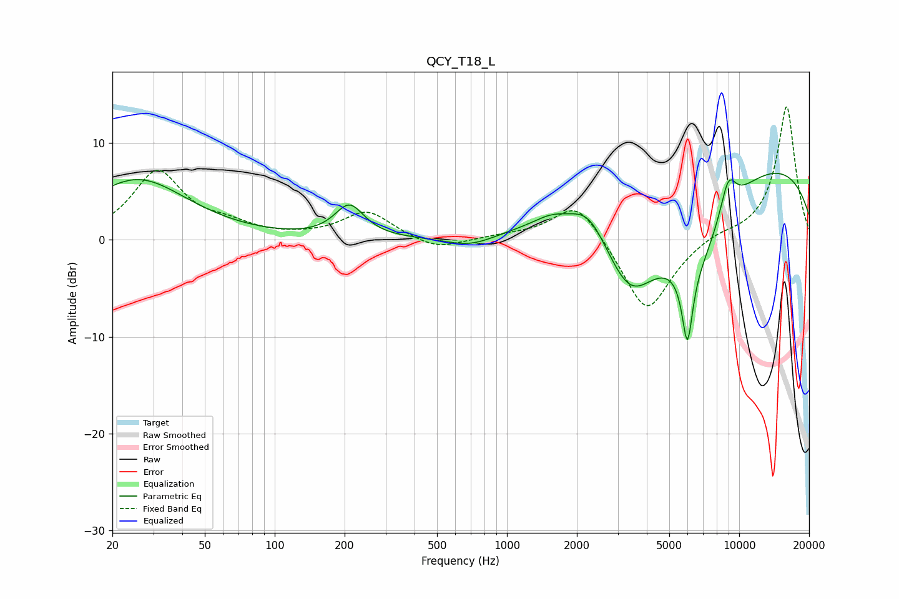

# QCY_T18_L
See [usage instructions](https://github.com/jaakkopasanen/AutoEq#usage) for more options and info.

### Parametric EQs
Apply preamp of -7.0 dB when using parametric equalizer.

|   # | Type    |   Fc (Hz) |    Q |   Gain (dB) |
|-----|---------|-----------|------|-------------|
|   1 | Peaking |        26 | 0.65 |         6.2 |
|   2 | Peaking |       210 | 2.25 |         3.3 |
|   3 | Peaking |       697 | 1.27 |        -1.2 |
|   4 | Peaking |      1557 | 1.86 |         1   |
|   5 | Peaking |      2252 | 1.8  |         2.9 |
|   6 | Peaking |      3395 | 1.06 |        -9.5 |
|   7 | Peaking |      5985 | 6    |        -7.7 |
|   8 | Peaking |      6503 | 0.94 |        -8.5 |
|   9 | Peaking |      8972 | 3.67 |         3.6 |
|  10 | Peaking |      9137 | 0.18 |         9   |

### Fixed Band EQs
When using fixed band (also called graphic) equalizer, apply preamp of **-13.8 dB** (if available) and set gains manually with these parameters.

|   # | Type    |   Fc (Hz) |    Q |   Gain (dB) |
|-----|---------|-----------|------|-------------|
|   1 | Peaking |        31 | 1.41 |         6.9 |
|   2 | Peaking |        62 | 1.41 |         1.1 |
|   3 | Peaking |       125 | 1.41 |         0.1 |
|   4 | Peaking |       250 | 1.41 |         2.9 |
|   5 | Peaking |       500 | 1.41 |        -1.2 |
|   6 | Peaking |      1000 | 1.41 |         0.3 |
|   7 | Peaking |      2000 | 1.41 |         4.2 |
|   8 | Peaking |      4000 | 1.41 |        -7.8 |
|   9 | Peaking |      8000 | 1.41 |         0.6 |
|  10 | Peaking |     16000 | 1.41 |        13.9 |

### Graphs

