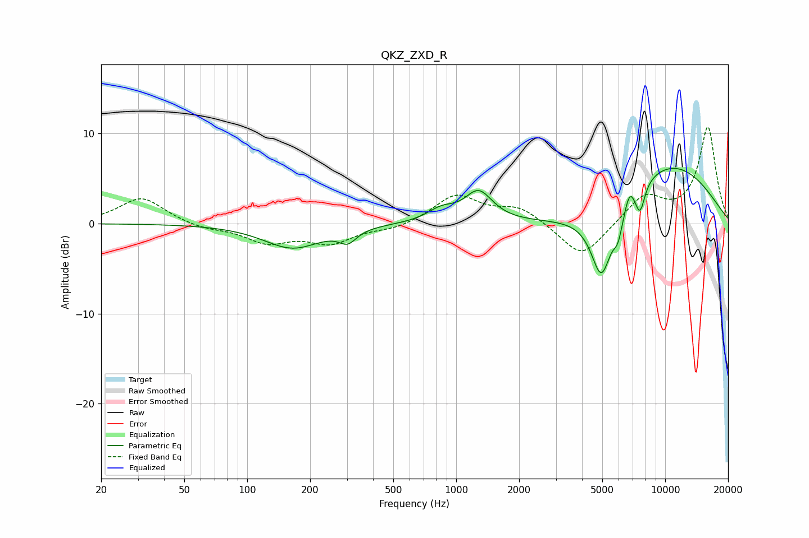

# QKZ_ZXD_R
See [usage instructions](https://github.com/jaakkopasanen/AutoEq#usage) for more options and info.

### Parametric EQs
Apply preamp of -6.2 dB when using parametric equalizer.

|   # | Type    |   Fc (Hz) |    Q |   Gain (dB) |
|-----|---------|-----------|------|-------------|
|   1 | Peaking |       165 | 1.03 |        -2.7 |
|   2 | Peaking |       303 | 3.45 |        -1.4 |
|   3 | Peaking |       850 | 2.06 |         1.3 |
|   4 | Peaking |      1281 | 2.15 |         3.3 |
|   5 | Peaking |      4490 | 0.65 |        -1.6 |
|   6 | Peaking |      4956 | 2.75 |        -7.6 |
|   7 | Peaking |      5956 | 5.78 |        -2.5 |
|   8 | Peaking |      6754 | 6    |         1.6 |
|   9 | Peaking |      7578 | 5.77 |        -3.1 |
|  10 | Peaking |     10000 | 0.44 |         6.9 |

### Fixed Band EQs
When using fixed band (also called graphic) equalizer, apply preamp of **-10.8 dB** (if available) and set gains manually with these parameters.

|   # | Type    |   Fc (Hz) |    Q |   Gain (dB) |
|-----|---------|-----------|------|-------------|
|   1 | Peaking |        31 | 1.41 |         2.9 |
|   2 | Peaking |        62 | 1.41 |        -0.6 |
|   3 | Peaking |       125 | 1.41 |        -2   |
|   4 | Peaking |       250 | 1.41 |        -2   |
|   5 | Peaking |       500 | 1.41 |        -0.6 |
|   6 | Peaking |      1000 | 1.41 |         3.1 |
|   7 | Peaking |      2000 | 1.41 |         1.8 |
|   8 | Peaking |      4000 | 1.41 |        -4   |
|   9 | Peaking |      8000 | 1.41 |         3   |
|  10 | Peaking |     16000 | 1.41 |        10.7 |

### Graphs

