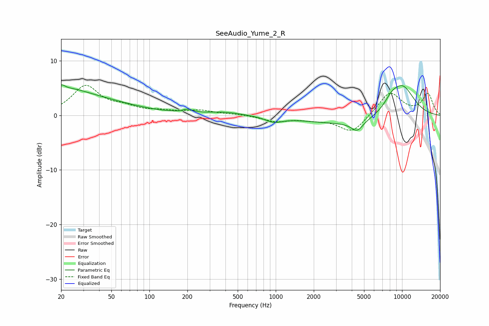

# SeeAudio_Yume_2_R
See [usage instructions](https://github.com/jaakkopasanen/AutoEq#usage) for more options and info.

### Parametric EQs
Apply preamp of -5.7 dB when using parametric equalizer.

|   # | Type    |   Fc (Hz) |    Q |   Gain (dB) |
|-----|---------|-----------|------|-------------|
|   1 | Peaking |        20 | 5.41 |         0.9 |
|   2 | Peaking |        20 | 0.31 |         3.9 |
|   3 | Peaking |        24 | 1.19 |         0.9 |
|   4 | Peaking |       201 | 3.99 |         0.6 |
|   5 | Peaking |       395 | 1    |         0.6 |
|   6 | Peaking |       965 | 2.13 |        -0.9 |
|   7 | Peaking |      4386 | 0.36 |        -1.7 |
|   8 | Peaking |      4409 | 2.96 |        -1.9 |
|   9 | Peaking |      8211 | 2.34 |         1.4 |
|  10 | Peaking |     10000 | 1.14 |         6   |

### Fixed Band EQs
When using fixed band (also called graphic) equalizer, apply preamp of **-5.6 dB** (if available) and set gains manually with these parameters.

|   # | Type    |   Fc (Hz) |    Q |   Gain (dB) |
|-----|---------|-----------|------|-------------|
|   1 | Peaking |        31 | 1.41 |         5.3 |
|   2 | Peaking |        62 | 1.41 |         1.2 |
|   3 | Peaking |       125 | 1.41 |         0.6 |
|   4 | Peaking |       250 | 1.41 |         0.8 |
|   5 | Peaking |       500 | 1.41 |         0.2 |
|   6 | Peaking |      1000 | 1.41 |        -1.1 |
|   7 | Peaking |      2000 | 1.41 |        -0.6 |
|   8 | Peaking |      4000 | 1.41 |        -3.2 |
|   9 | Peaking |      8000 | 1.41 |         4.3 |
|  10 | Peaking |     16000 | 1.41 |         3.9 |

### Graphs

