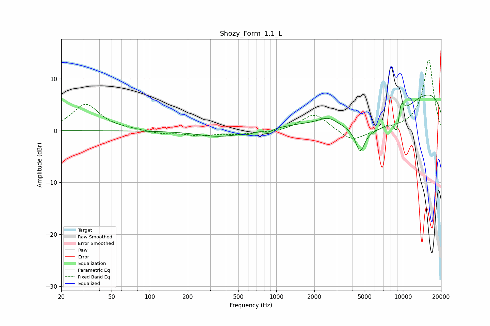

# Shozy_Form_1.1_L
See [usage instructions](https://github.com/jaakkopasanen/AutoEq#usage) for more options and info.

### Parametric EQs
Apply preamp of -7.0 dB when using parametric equalizer.

|   # | Type    |   Fc (Hz) |    Q |   Gain (dB) |
|-----|---------|-----------|------|-------------|
|   1 | Peaking |       362 | 0.82 |        -1.2 |
|   2 | Peaking |       598 | 4.17 |        -0.4 |
|   3 | Peaking |       863 | 4.14 |        -0.6 |
|   4 | Peaking |      2576 | 2    |         1.3 |
|   5 | Peaking |      4593 | 3.96 |        -4.4 |
|   6 | Peaking |      6004 | 0.45 |        -9   |
|   7 | Peaking |      9054 | 5.07 |        -4.8 |
|   8 | Peaking |      9477 | 5.88 |         3   |
|   9 | Peaking |      9838 | 5.98 |         1.5 |
|  10 | Peaking |     10000 | 0.18 |        10.3 |

### Fixed Band EQs
When using fixed band (also called graphic) equalizer, apply preamp of **-13.8 dB** (if available) and set gains manually with these parameters.

|   # | Type    |   Fc (Hz) |    Q |   Gain (dB) |
|-----|---------|-----------|------|-------------|
|   1 | Peaking |        31 | 1.41 |         5.1 |
|   2 | Peaking |        62 | 1.41 |         0.2 |
|   3 | Peaking |       125 | 1.41 |        -0.6 |
|   4 | Peaking |       250 | 1.41 |        -0.9 |
|   5 | Peaking |       500 | 1.41 |        -0.6 |
|   6 | Peaking |      1000 | 1.41 |        -0.3 |
|   7 | Peaking |      2000 | 1.41 |         3.4 |
|   8 | Peaking |      4000 | 1.41 |        -2.3 |
|   9 | Peaking |      8000 | 1.41 |         0.3 |
|  10 | Peaking |     16000 | 1.41 |        13.8 |

### Graphs

