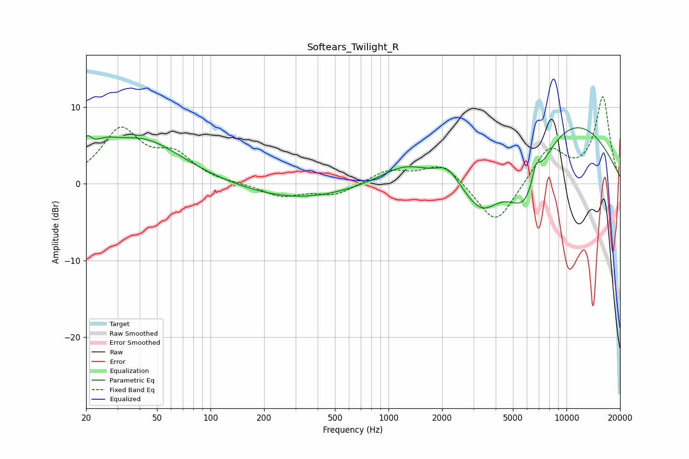

# Softears_Twilight_R
See [usage instructions](https://github.com/jaakkopasanen/AutoEq#usage) for more options and info.

### Parametric EQs
Apply preamp of -7.4 dB when using parametric equalizer.

|   # | Type    |   Fc (Hz) |    Q |   Gain (dB) |
|-----|---------|-----------|------|-------------|
|   1 | Peaking |        20 | 5.56 |         2.2 |
|   2 | Peaking |        25 | 1.78 |         1.9 |
|   3 | Peaking |        41 | 0.63 |         5.6 |
|   4 | Peaking |       306 | 0.46 |        -2.1 |
|   5 | Peaking |      1234 | 1.01 |         2.4 |
|   6 | Peaking |      2143 | 2.35 |         1.9 |
|   7 | Peaking |      3330 | 1.33 |        -5.2 |
|   8 | Peaking |      5882 | 1.29 |        -8.1 |
|   9 | Peaking |      6730 | 5.92 |         2.5 |
|  10 | Peaking |      9816 | 0.38 |         8.9 |

### Fixed Band EQs
When using fixed band (also called graphic) equalizer, apply preamp of **-11.4 dB** (if available) and set gains manually with these parameters.

|   # | Type    |   Fc (Hz) |    Q |   Gain (dB) |
|-----|---------|-----------|------|-------------|
|   1 | Peaking |        31 | 1.41 |         6.8 |
|   2 | Peaking |        62 | 1.41 |         3.3 |
|   3 | Peaking |       125 | 1.41 |        -0.1 |
|   4 | Peaking |       250 | 1.41 |        -1.6 |
|   5 | Peaking |       500 | 1.41 |        -1.5 |
|   6 | Peaking |      1000 | 1.41 |         1.7 |
|   7 | Peaking |      2000 | 1.41 |         2.7 |
|   8 | Peaking |      4000 | 1.41 |        -5.7 |
|   9 | Peaking |      8000 | 1.41 |         4.6 |
|  10 | Peaking |     16000 | 1.41 |        11.2 |

### Graphs

