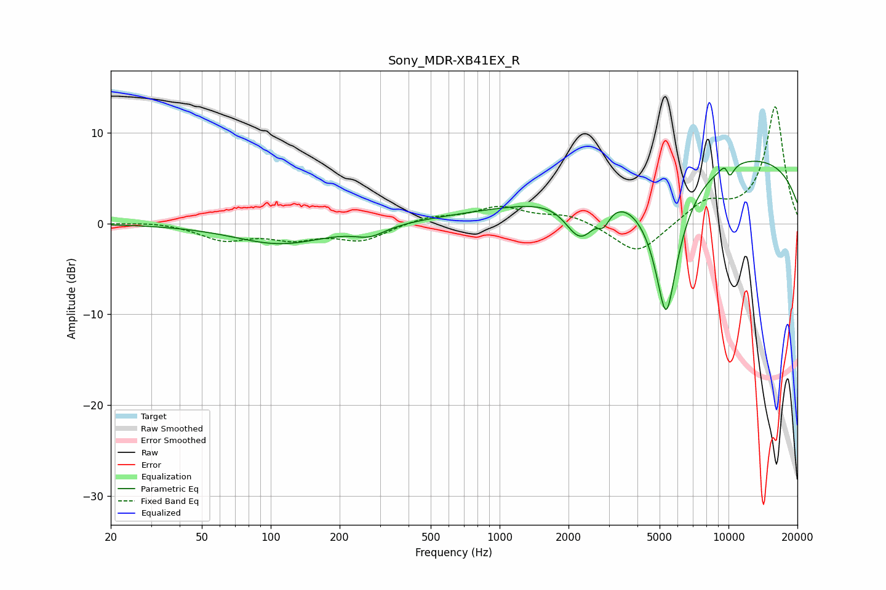

# Sony_MDR-XB41EX_R
See [usage instructions](https://github.com/jaakkopasanen/AutoEq#usage) for more options and info.

### Parametric EQs
Apply preamp of -7.0 dB when using parametric equalizer.

|   # | Type    |   Fc (Hz) |    Q |   Gain (dB) |
|-----|---------|-----------|------|-------------|
|   1 | Peaking |       110 | 0.71 |        -2.2 |
|   2 | Peaking |       271 | 2.07 |        -1.1 |
|   3 | Peaking |      1160 | 0.41 |         1   |
|   4 | Peaking |      2174 | 2.3  |        -3.2 |
|   5 | Peaking |      2377 | 3.05 |        -1.5 |
|   6 | Peaking |      2845 | 5.03 |        -1.8 |
|   7 | Peaking |      5342 | 2.37 |       -16.3 |
|   8 | Peaking |      9793 | 5.9  |         2.3 |
|   9 | Peaking |     10000 | 0.21 |         7.7 |
|  10 | Peaking |     10000 | 5.82 |        -2.9 |

### Fixed Band EQs
When using fixed band (also called graphic) equalizer, apply preamp of **-13.0 dB** (if available) and set gains manually with these parameters.

|   # | Type    |   Fc (Hz) |    Q |   Gain (dB) |
|-----|---------|-----------|------|-------------|
|   1 | Peaking |        31 | 1.41 |         0.3 |
|   2 | Peaking |        62 | 1.41 |        -1.7 |
|   3 | Peaking |       125 | 1.41 |        -1.4 |
|   4 | Peaking |       250 | 1.41 |        -1.8 |
|   5 | Peaking |       500 | 1.41 |         0.8 |
|   6 | Peaking |      1000 | 1.41 |         1.7 |
|   7 | Peaking |      2000 | 1.41 |         1   |
|   8 | Peaking |      4000 | 1.41 |        -3.5 |
|   9 | Peaking |      8000 | 1.41 |         2.3 |
|  10 | Peaking |     16000 | 1.41 |        12.9 |

### Graphs

