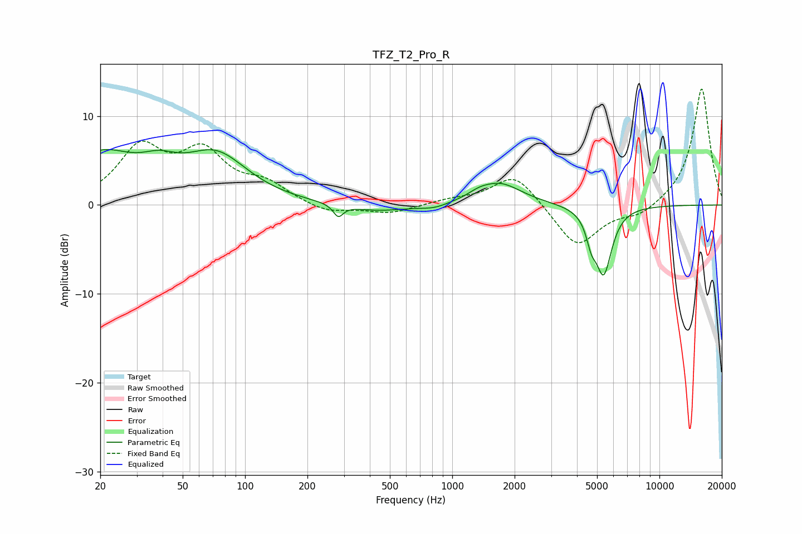

# TFZ_T2_Pro_R
See [usage instructions](https://github.com/jaakkopasanen/AutoEq#usage) for more options and info.

### Parametric EQs
Apply preamp of -6.3 dB when using parametric equalizer.

|   # | Type    |   Fc (Hz) |    Q |   Gain (dB) |
|-----|---------|-----------|------|-------------|
|   1 | Peaking |        20 | 0.83 |         5.3 |
|   2 | Peaking |        39 | 1.6  |         1.8 |
|   3 | Peaking |        73 | 0.92 |         5.2 |
|   4 | Peaking |       282 | 5.97 |        -1.4 |
|   5 | Peaking |       437 | 0.94 |        -0.8 |
|   6 | Peaking |       819 | 2.08 |        -0.5 |
|   7 | Peaking |      1340 | 3.02 |         0.4 |
|   8 | Peaking |      1687 | 1.32 |         2.5 |
|   9 | Peaking |      4689 | 5.95 |        -2.2 |
|  10 | Peaking |      5379 | 3.52 |        -7.5 |

### Fixed Band EQs
When using fixed band (also called graphic) equalizer, apply preamp of **-13.1 dB** (if available) and set gains manually with these parameters.

|   # | Type    |   Fc (Hz) |    Q |   Gain (dB) |
|-----|---------|-----------|------|-------------|
|   1 | Peaking |        31 | 1.41 |         6.1 |
|   2 | Peaking |        62 | 1.41 |         5.4 |
|   3 | Peaking |       125 | 1.41 |         2.1 |
|   4 | Peaking |       250 | 1.41 |        -1   |
|   5 | Peaking |       500 | 1.41 |        -0.9 |
|   6 | Peaking |      1000 | 1.41 |         0.5 |
|   7 | Peaking |      2000 | 1.41 |         3.6 |
|   8 | Peaking |      4000 | 1.41 |        -4.9 |
|   9 | Peaking |      8000 | 1.41 |        -1.2 |
|  10 | Peaking |     16000 | 1.41 |        13.2 |

### Graphs

