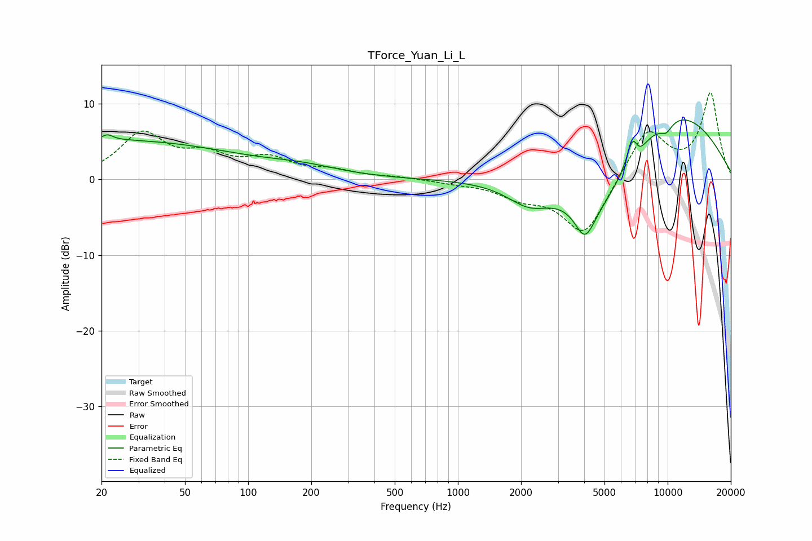

# TForce_Yuan_Li_L
See [usage instructions](https://github.com/jaakkopasanen/AutoEq#usage) for more options and info.

### Parametric EQs
Apply preamp of -8.0 dB when using parametric equalizer.

|   # | Type    |   Fc (Hz) |    Q |   Gain (dB) |
|-----|---------|-----------|------|-------------|
|   1 | Peaking |        20 | 0.19 |         5.2 |
|   2 | Peaking |        21 | 5.71 |         0.7 |
|   3 | Peaking |       185 | 0.8  |         1   |
|   4 | Peaking |      2187 | 1.33 |        -2.9 |
|   5 | Peaking |      4031 | 2.94 |        -4.4 |
|   6 | Peaking |      4768 | 0.8  |        -7.8 |
|   7 | Peaking |      6818 | 5.07 |         3.6 |
|   8 | Peaking |      7208 | 4.3  |        -1.4 |
|   9 | Peaking |      9825 | 3.89 |        -1.4 |
|  10 | Peaking |     10000 | 0.39 |        10   |

### Fixed Band EQs
When using fixed band (also called graphic) equalizer, apply preamp of **-11.6 dB** (if available) and set gains manually with these parameters.

|   # | Type    |   Fc (Hz) |    Q |   Gain (dB) |
|-----|---------|-----------|------|-------------|
|   1 | Peaking |        31 | 1.41 |         5.8 |
|   2 | Peaking |        62 | 1.41 |         2.6 |
|   3 | Peaking |       125 | 1.41 |         2.4 |
|   4 | Peaking |       250 | 1.41 |         1   |
|   5 | Peaking |       500 | 1.41 |         0.3 |
|   6 | Peaking |      1000 | 1.41 |        -0.4 |
|   7 | Peaking |      2000 | 1.41 |        -2   |
|   8 | Peaking |      4000 | 1.41 |        -7.5 |
|   9 | Peaking |      8000 | 1.41 |         6.8 |
|  10 | Peaking |     16000 | 1.41 |        11.3 |

### Graphs

