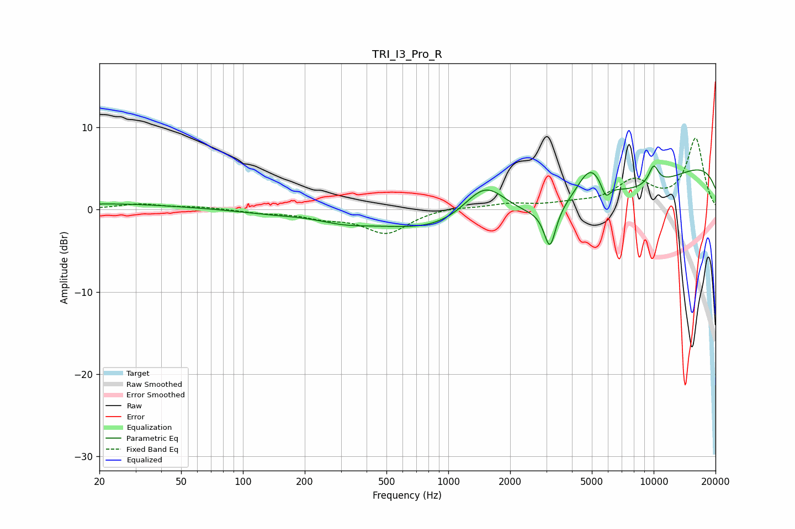

# TRI_I3_Pro_R
See [usage instructions](https://github.com/jaakkopasanen/AutoEq#usage) for more options and info.

### Parametric EQs
Apply preamp of -5.4 dB when using parametric equalizer.

|   # | Type    |   Fc (Hz) |    Q |   Gain (dB) |
|-----|---------|-----------|------|-------------|
|   1 | Peaking |        23 | 0.46 |         0.7 |
|   2 | Peaking |       134 | 0.97 |        -0.3 |
|   3 | Peaking |       309 | 1.07 |        -0.9 |
|   4 | Peaking |      1514 | 1.2  |         5.9 |
|   5 | Peaking |      3124 | 5.01 |        -4.8 |
|   6 | Peaking |      3628 | 0.19 |        -7.3 |
|   7 | Peaking |      4919 | 2.01 |         4.5 |
|   8 | Peaking |      5841 | 6    |        -1.9 |
|   9 | Peaking |     10000 | 0.18 |         8.2 |
|  10 | Peaking |     10000 | 4.96 |         2.3 |

### Fixed Band EQs
When using fixed band (also called graphic) equalizer, apply preamp of **-8.8 dB** (if available) and set gains manually with these parameters.

|   # | Type    |   Fc (Hz) |    Q |   Gain (dB) |
|-----|---------|-----------|------|-------------|
|   1 | Peaking |        31 | 1.41 |         0.7 |
|   2 | Peaking |        62 | 1.41 |         0.3 |
|   3 | Peaking |       125 | 1.41 |        -0.3 |
|   4 | Peaking |       250 | 1.41 |        -0.8 |
|   5 | Peaking |       500 | 1.41 |        -2.8 |
|   6 | Peaking |      1000 | 1.41 |         0.3 |
|   7 | Peaking |      2000 | 1.41 |         0.6 |
|   8 | Peaking |      4000 | 1.41 |         0.5 |
|   9 | Peaking |      8000 | 1.41 |         3.2 |
|  10 | Peaking |     16000 | 1.41 |         8.6 |

### Graphs

