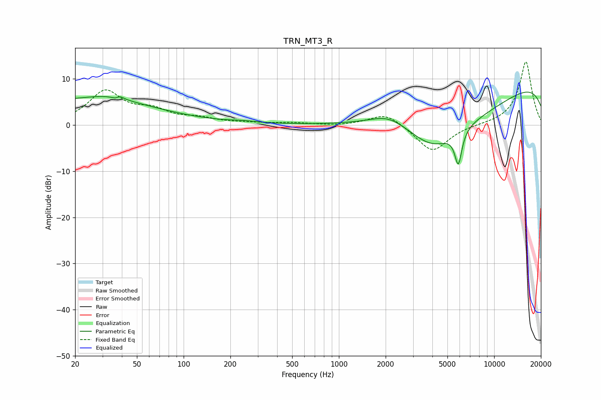

# TRN_MT3_R
See [usage instructions](https://github.com/jaakkopasanen/AutoEq#usage) for more options and info.

### Parametric EQs
Apply preamp of -7.2 dB when using parametric equalizer.

|   # | Type    |   Fc (Hz) |    Q |   Gain (dB) |
|-----|---------|-----------|------|-------------|
|   1 | Peaking |        20 | 0.24 |         5.2 |
|   2 | Peaking |        33 | 1.03 |         1.2 |
|   3 | Peaking |        38 | 5.67 |        -2.2 |
|   4 | Peaking |        38 | 5.93 |         2.4 |
|   5 | Peaking |       243 | 1.58 |         0.3 |
|   6 | Peaking |      2099 | 1.15 |         2.7 |
|   7 | Peaking |      4044 | 0.92 |        -5.4 |
|   8 | Peaking |      5878 | 6    |        -7.2 |
|   9 | Peaking |      5998 | 0.3  |       -10   |
|  10 | Peaking |      9944 | 0.18 |        12.9 |

### Fixed Band EQs
When using fixed band (also called graphic) equalizer, apply preamp of **-13.7 dB** (if available) and set gains manually with these parameters.

|   # | Type    |   Fc (Hz) |    Q |   Gain (dB) |
|-----|---------|-----------|------|-------------|
|   1 | Peaking |        31 | 1.41 |         7   |
|   2 | Peaking |        62 | 1.41 |         2.6 |
|   3 | Peaking |       125 | 1.41 |         1.2 |
|   4 | Peaking |       250 | 1.41 |         0.3 |
|   5 | Peaking |       500 | 1.41 |         0.4 |
|   6 | Peaking |      1000 | 1.41 |        -0.2 |
|   7 | Peaking |      2000 | 1.41 |         2.8 |
|   8 | Peaking |      4000 | 1.41 |        -6   |
|   9 | Peaking |      8000 | 1.41 |         0   |
|  10 | Peaking |     16000 | 1.41 |        13.8 |

### Graphs

