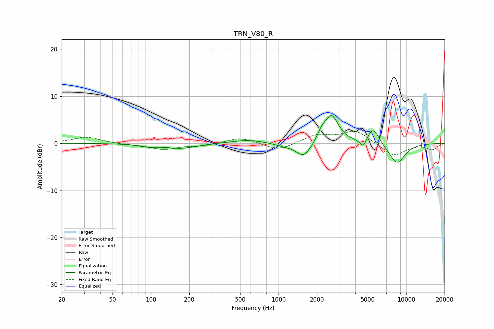

# TRN_V80_R
See [usage instructions](https://github.com/jaakkopasanen/AutoEq#usage) for more options and info.

### Parametric EQs
Apply preamp of -6.0 dB when using parametric equalizer.

|   # | Type    |   Fc (Hz) |    Q |   Gain (dB) |
|-----|---------|-----------|------|-------------|
|   1 | Peaking |        95 | 1.94 |        -0.5 |
|   2 | Peaking |       171 | 1.19 |        -1   |
|   3 | Peaking |       579 | 1.08 |         0.8 |
|   4 | Peaking |      1117 | 1.8  |        -0.6 |
|   5 | Peaking |      1581 | 2.43 |        -3.1 |
|   6 | Peaking |      2179 | 4.37 |         1.5 |
|   7 | Peaking |      2604 | 2.6  |         5.9 |
|   8 | Peaking |      4611 | 5.68 |        -1.9 |
|   9 | Peaking |      5506 | 2.95 |         3.5 |
|  10 | Peaking |      8467 | 2    |        -4.4 |

### Fixed Band EQs
When using fixed band (also called graphic) equalizer, apply preamp of **-2.6 dB** (if available) and set gains manually with these parameters.

|   # | Type    |   Fc (Hz) |    Q |   Gain (dB) |
|-----|---------|-----------|------|-------------|
|   1 | Peaking |        31 | 1.41 |         1.4 |
|   2 | Peaking |        62 | 1.41 |        -0.2 |
|   3 | Peaking |       125 | 1.41 |        -1.3 |
|   4 | Peaking |       250 | 1.41 |        -0.5 |
|   5 | Peaking |       500 | 1.41 |         1.3 |
|   6 | Peaking |      1000 | 1.41 |        -1.6 |
|   7 | Peaking |      2000 | 1.41 |         1.7 |
|   8 | Peaking |      4000 | 1.41 |         2.7 |
|   9 | Peaking |      8000 | 1.41 |        -2.8 |
|  10 | Peaking |     16000 | 1.41 |        -1.3 |

### Graphs

