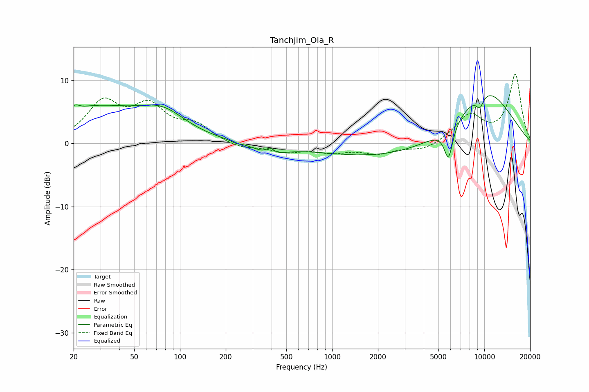

# Tanchjim_Ola_R
See [usage instructions](https://github.com/jaakkopasanen/AutoEq#usage) for more options and info.

### Parametric EQs
Apply preamp of -7.7 dB when using parametric equalizer.

|   # | Type    |   Fc (Hz) |    Q |   Gain (dB) |
|-----|---------|-----------|------|-------------|
|   1 | Peaking |        20 | 5.91 |         0.7 |
|   2 | Peaking |        27 | 0.46 |         5.3 |
|   3 | Peaking |        77 | 0.91 |         3.6 |
|   4 | Peaking |       233 | 5.8  |        -0.2 |
|   5 | Peaking |       390 | 1.46 |        -1.5 |
|   6 | Peaking |       391 | 5.89 |         0.9 |
|   7 | Peaking |      3057 | 0.26 |        -2.6 |
|   8 | Peaking |      5820 | 4.73 |        -5.2 |
|   9 | Peaking |      9347 | 4.99 |        -1.9 |
|  10 | Peaking |     10000 | 0.58 |         9.4 |

### Fixed Band EQs
When using fixed band (also called graphic) equalizer, apply preamp of **-11.0 dB** (if available) and set gains manually with these parameters.

|   # | Type    |   Fc (Hz) |    Q |   Gain (dB) |
|-----|---------|-----------|------|-------------|
|   1 | Peaking |        31 | 1.41 |         6.1 |
|   2 | Peaking |        62 | 1.41 |         5.2 |
|   3 | Peaking |       125 | 1.41 |         2.5 |
|   4 | Peaking |       250 | 1.41 |        -0.9 |
|   5 | Peaking |       500 | 1.41 |        -1.2 |
|   6 | Peaking |      1000 | 1.41 |        -1.2 |
|   7 | Peaking |      2000 | 1.41 |        -1.4 |
|   8 | Peaking |      4000 | 1.41 |        -1.1 |
|   9 | Peaking |      8000 | 1.41 |         4.3 |
|  10 | Peaking |     16000 | 1.41 |        10.8 |

### Graphs

