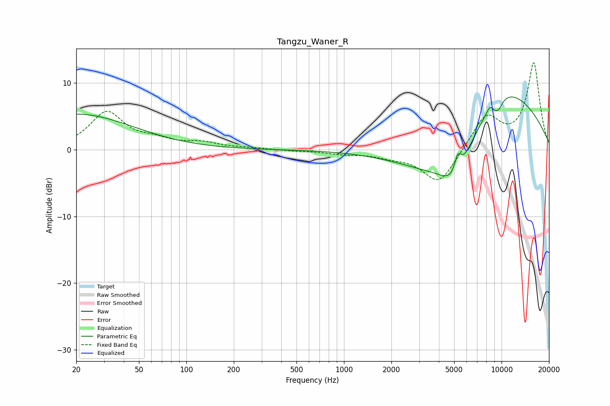

# Tangzu_Waner_R
See [usage instructions](https://github.com/jaakkopasanen/AutoEq#usage) for more options and info.

### Parametric EQs
Apply preamp of -8.0 dB when using parametric equalizer.

|   # | Type    |   Fc (Hz) |    Q |   Gain (dB) |
|-----|---------|-----------|------|-------------|
|   1 | Peaking |        20 | 0.39 |         5.3 |
|   2 | Peaking |      4063 | 0.49 |        -2.9 |
|   3 | Peaking |      4299 | 0.62 |        -3.4 |
|   4 | Peaking |      5111 | 1.63 |        -4.9 |
|   5 | Peaking |      5280 | 6    |         3   |
|   6 | Peaking |      8516 | 5.08 |         2.6 |
|   7 | Peaking |      8673 | 4.08 |        -2.2 |
|   8 | Peaking |      9558 | 0.68 |         3.7 |
|   9 | Peaking |      9570 | 4.79 |        -1.3 |
|  10 | Peaking |     10000 | 0.31 |         6.8 |

### Fixed Band EQs
When using fixed band (also called graphic) equalizer, apply preamp of **-13.1 dB** (if available) and set gains manually with these parameters.

|   # | Type    |   Fc (Hz) |    Q |   Gain (dB) |
|-----|---------|-----------|------|-------------|
|   1 | Peaking |        31 | 1.41 |         5.5 |
|   2 | Peaking |        62 | 1.41 |         1.1 |
|   3 | Peaking |       125 | 1.41 |         0.9 |
|   4 | Peaking |       250 | 1.41 |         0.2 |
|   5 | Peaking |       500 | 1.41 |        -0.2 |
|   6 | Peaking |      1000 | 1.41 |        -0.5 |
|   7 | Peaking |      2000 | 1.41 |        -0.8 |
|   8 | Peaking |      4000 | 1.41 |        -5.2 |
|   9 | Peaking |      8000 | 1.41 |         5.1 |
|  10 | Peaking |     16000 | 1.41 |        12.9 |

### Graphs

