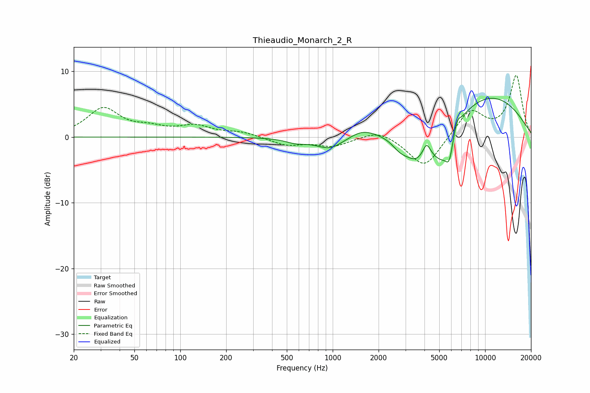

# Thieaudio_Monarch_2_R
See [usage instructions](https://github.com/jaakkopasanen/AutoEq#usage) for more options and info.

### Parametric EQs
Apply preamp of -6.0 dB when using parametric equalizer.

|   # | Type    |   Fc (Hz) |    Q |   Gain (dB) |
|-----|---------|-----------|------|-------------|
|   1 | Peaking |       574 | 2.05 |        -0.7 |
|   2 | Peaking |       962 | 1.51 |        -1.9 |
|   3 | Peaking |      1566 | 1.62 |         1.2 |
|   4 | Peaking |      2770 | 2.56 |        -1.6 |
|   5 | Peaking |      3507 | 1.89 |        -3.7 |
|   6 | Peaking |      4128 | 6    |         1.8 |
|   7 | Peaking |      5217 | 1.67 |        -6.2 |
|   8 | Peaking |      5823 | 5.83 |        -3   |
|   9 | Peaking |      6533 | 6    |         1.7 |
|  10 | Peaking |     10000 | 0.38 |         6.5 |

### Fixed Band EQs
When using fixed band (also called graphic) equalizer, apply preamp of **-9.5 dB** (if available) and set gains manually with these parameters.

|   # | Type    |   Fc (Hz) |    Q |   Gain (dB) |
|-----|---------|-----------|------|-------------|
|   1 | Peaking |        31 | 1.41 |         4.2 |
|   2 | Peaking |        62 | 1.41 |         1.1 |
|   3 | Peaking |       125 | 1.41 |         1.5 |
|   4 | Peaking |       250 | 1.41 |         0.7 |
|   5 | Peaking |       500 | 1.41 |        -1.2 |
|   6 | Peaking |      1000 | 1.41 |        -1.3 |
|   7 | Peaking |      2000 | 1.41 |         1.3 |
|   8 | Peaking |      4000 | 1.41 |        -4.8 |
|   9 | Peaking |      8000 | 1.41 |         4.1 |
|  10 | Peaking |     16000 | 1.41 |         9.3 |

### Graphs

