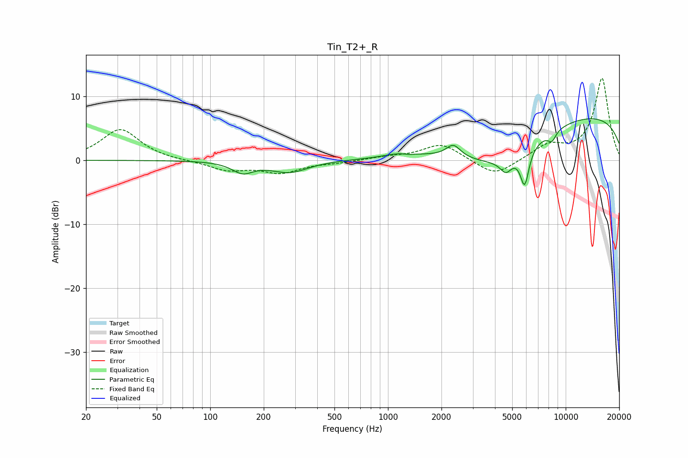

# Tin_T2+_R
See [usage instructions](https://github.com/jaakkopasanen/AutoEq#usage) for more options and info.

### Parametric EQs
Apply preamp of -6.6 dB when using parametric equalizer.

|   # | Type    |   Fc (Hz) |    Q |   Gain (dB) |
|-----|---------|-----------|------|-------------|
|   1 | Peaking |       152 | 2.4  |        -1.7 |
|   2 | Peaking |       279 | 1.35 |        -1.8 |
|   3 | Peaking |      1138 | 1.85 |         0.5 |
|   4 | Peaking |      1312 | 5.83 |        -0.1 |
|   5 | Peaking |      2332 | 3.62 |         1.9 |
|   6 | Peaking |      4194 | 0.6  |        -5.9 |
|   7 | Peaking |      4610 | 4.18 |        -2.1 |
|   8 | Peaking |      5878 | 5.6  |        -5.6 |
|   9 | Peaking |      8369 | 5.67 |        -1.5 |
|  10 | Peaking |     10000 | 0.18 |         7.6 |

### Fixed Band EQs
When using fixed band (also called graphic) equalizer, apply preamp of **-12.9 dB** (if available) and set gains manually with these parameters.

|   # | Type    |   Fc (Hz) |    Q |   Gain (dB) |
|-----|---------|-----------|------|-------------|
|   1 | Peaking |        31 | 1.41 |         4.9 |
|   2 | Peaking |        62 | 1.41 |        -0.1 |
|   3 | Peaking |       125 | 1.41 |        -1.5 |
|   4 | Peaking |       250 | 1.41 |        -1.8 |
|   5 | Peaking |       500 | 1.41 |        -0.3 |
|   6 | Peaking |      1000 | 1.41 |         0.5 |
|   7 | Peaking |      2000 | 1.41 |         2.6 |
|   8 | Peaking |      4000 | 1.41 |        -2.6 |
|   9 | Peaking |      8000 | 1.41 |         2.2 |
|  10 | Peaking |     16000 | 1.41 |        12.8 |

### Graphs

