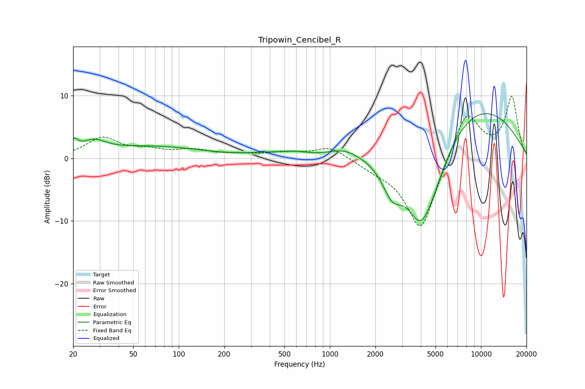

# Tripowin_Cencibel_R
See [usage instructions](https://github.com/jaakkopasanen/AutoEq#usage) for more options and info.

### Parametric EQs
Apply preamp of -7.2 dB when using parametric equalizer.

|   # | Type    |   Fc (Hz) |    Q |   Gain (dB) |
|-----|---------|-----------|------|-------------|
|   1 | Peaking |        20 | 5.54 |         1.6 |
|   2 | Peaking |        27 | 1.81 |         1.9 |
|   3 | Peaking |        67 | 0.43 |         1.8 |
|   4 | Peaking |       386 | 1.15 |         0.5 |
|   5 | Peaking |       588 | 1.74 |         0.6 |
|   6 | Peaking |      1242 | 1.39 |         1.3 |
|   7 | Peaking |      2586 | 2.13 |        -4.8 |
|   8 | Peaking |      3988 | 1.27 |       -12.1 |
|   9 | Peaking |      4844 | 1.2  |        -3.6 |
|  10 | Peaking |      8581 | 0.35 |         9.1 |

### Fixed Band EQs
When using fixed band (also called graphic) equalizer, apply preamp of **-10.0 dB** (if available) and set gains manually with these parameters.

|   # | Type    |   Fc (Hz) |    Q |   Gain (dB) |
|-----|---------|-----------|------|-------------|
|   1 | Peaking |        31 | 1.41 |         3.1 |
|   2 | Peaking |        62 | 1.41 |         1   |
|   3 | Peaking |       125 | 1.41 |         1.2 |
|   4 | Peaking |       250 | 1.41 |         0.5 |
|   5 | Peaking |       500 | 1.41 |         0.8 |
|   6 | Peaking |      1000 | 1.41 |         1.9 |
|   7 | Peaking |      2000 | 1.41 |        -1   |
|   8 | Peaking |      4000 | 1.41 |       -12   |
|   9 | Peaking |      8000 | 1.41 |         8.1 |
|  10 | Peaking |     16000 | 1.41 |         9.7 |

### Graphs

