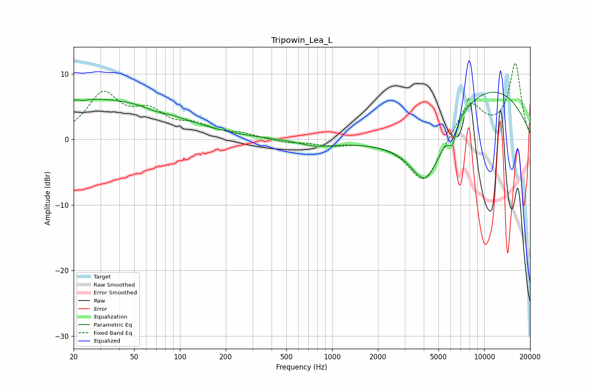

# Tripowin_Lea_L
See [usage instructions](https://github.com/jaakkopasanen/AutoEq#usage) for more options and info.

### Parametric EQs
Apply preamp of -7.3 dB when using parametric equalizer.

|   # | Type    |   Fc (Hz) |    Q |   Gain (dB) |
|-----|---------|-----------|------|-------------|
|   1 | Peaking |        22 | 5.75 |         3.3 |
|   2 | Peaking |        22 | 5.77 |        -3.4 |
|   3 | Peaking |        25 | 0.24 |         4.9 |
|   4 | Peaking |        32 | 0.35 |         1.2 |
|   5 | Peaking |        68 | 2.77 |        -0.3 |
|   6 | Peaking |       779 | 1.34 |        -0.9 |
|   7 | Peaking |      4082 | 0.35 |        -2.1 |
|   8 | Peaking |      4138 | 1.26 |        -9.2 |
|   9 | Peaking |      6180 | 5.75 |        -2.7 |
|  10 | Peaking |      9576 | 0.33 |         9.1 |

### Fixed Band EQs
When using fixed band (also called graphic) equalizer, apply preamp of **-11.7 dB** (if available) and set gains manually with these parameters.

|   # | Type    |   Fc (Hz) |    Q |   Gain (dB) |
|-----|---------|-----------|------|-------------|
|   1 | Peaking |        31 | 1.41 |         6.6 |
|   2 | Peaking |        62 | 1.41 |         3.5 |
|   3 | Peaking |       125 | 1.41 |         1.8 |
|   4 | Peaking |       250 | 1.41 |         0.7 |
|   5 | Peaking |       500 | 1.41 |        -0.5 |
|   6 | Peaking |      1000 | 1.41 |        -0.8 |
|   7 | Peaking |      2000 | 1.41 |        -0.2 |
|   8 | Peaking |      4000 | 1.41 |        -6.9 |
|   9 | Peaking |      8000 | 1.41 |         5.7 |
|  10 | Peaking |     16000 | 1.41 |        11.5 |

### Graphs

