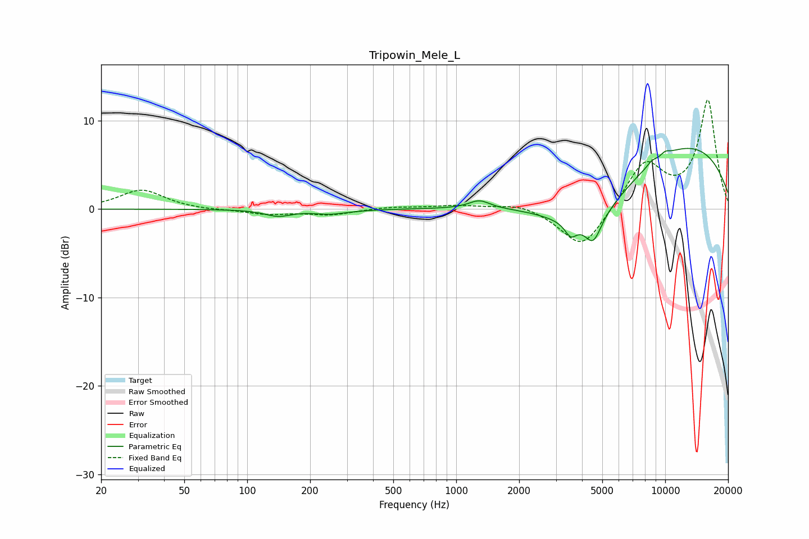

# Tripowin_Mele_L
See [usage instructions](https://github.com/jaakkopasanen/AutoEq#usage) for more options and info.

### Parametric EQs
Apply preamp of -7.0 dB when using parametric equalizer.

|   # | Type    |   Fc (Hz) |    Q |   Gain (dB) |
|-----|---------|-----------|------|-------------|
|   1 | Peaking |       140 | 2.22 |        -0.7 |
|   2 | Peaking |       247 | 1.89 |        -0.5 |
|   3 | Peaking |       323 | 1.98 |        -0.1 |
|   4 | Peaking |      1291 | 2.83 |         0.9 |
|   5 | Peaking |      3533 | 5.09 |        -1.5 |
|   6 | Peaking |      4390 | 0.64 |        -6.9 |
|   7 | Peaking |      4528 | 3.72 |        -2.8 |
|   8 | Peaking |      8623 | 5.94 |         0.4 |
|   9 | Peaking |     10000 | 0.25 |         8.3 |
|  10 | Peaking |     10000 | 5.67 |         0.4 |

### Fixed Band EQs
When using fixed band (also called graphic) equalizer, apply preamp of **-12.4 dB** (if available) and set gains manually with these parameters.

|   # | Type    |   Fc (Hz) |    Q |   Gain (dB) |
|-----|---------|-----------|------|-------------|
|   1 | Peaking |        31 | 1.41 |         2.2 |
|   2 | Peaking |        62 | 1.41 |        -0.1 |
|   3 | Peaking |       125 | 1.41 |        -0.6 |
|   4 | Peaking |       250 | 1.41 |        -0.6 |
|   5 | Peaking |       500 | 1.41 |         0.3 |
|   6 | Peaking |      1000 | 1.41 |         0.4 |
|   7 | Peaking |      2000 | 1.41 |         0.7 |
|   8 | Peaking |      4000 | 1.41 |        -4.7 |
|   9 | Peaking |      8000 | 1.41 |         5.2 |
|  10 | Peaking |     16000 | 1.41 |        12.2 |

### Graphs

