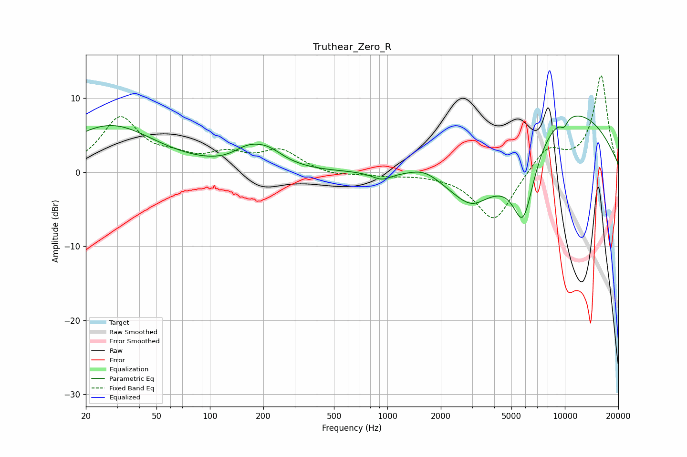

# Truthear_Zero_R
See [usage instructions](https://github.com/jaakkopasanen/AutoEq#usage) for more options and info.

### Parametric EQs
Apply preamp of -7.7 dB when using parametric equalizer.

|   # | Type    |   Fc (Hz) |    Q |   Gain (dB) |
|-----|---------|-----------|------|-------------|
|   1 | Peaking |        28 | 0.56 |         6.3 |
|   2 | Peaking |       161 | 1.8  |         1.6 |
|   3 | Peaking |       209 | 1.48 |         2.3 |
|   4 | Peaking |       930 | 2.53 |        -1   |
|   5 | Peaking |      1617 | 1.71 |         1.1 |
|   6 | Peaking |      3210 | 0.86 |       -10.2 |
|   7 | Peaking |      3460 | 1.91 |         1.3 |
|   8 | Peaking |      5824 | 1.94 |       -11.3 |
|   9 | Peaking |      8358 | 0.3  |        10.2 |
|  10 | Peaking |      9882 | 5.9  |        -1.1 |

### Fixed Band EQs
When using fixed band (also called graphic) equalizer, apply preamp of **-13.1 dB** (if available) and set gains manually with these parameters.

|   # | Type    |   Fc (Hz) |    Q |   Gain (dB) |
|-----|---------|-----------|------|-------------|
|   1 | Peaking |        31 | 1.41 |         7.2 |
|   2 | Peaking |        62 | 1.41 |         1.4 |
|   3 | Peaking |       125 | 1.41 |         2.1 |
|   4 | Peaking |       250 | 1.41 |         2.8 |
|   5 | Peaking |       500 | 1.41 |        -0.6 |
|   6 | Peaking |      1000 | 1.41 |        -0.4 |
|   7 | Peaking |      2000 | 1.41 |        -0.2 |
|   8 | Peaking |      4000 | 1.41 |        -6.8 |
|   9 | Peaking |      8000 | 1.41 |         3.3 |
|  10 | Peaking |     16000 | 1.41 |        13   |

### Graphs

