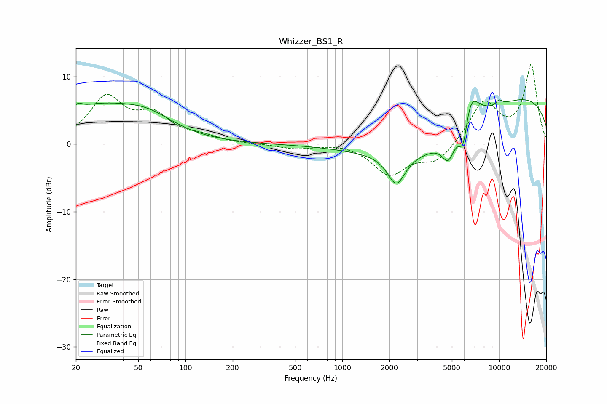

# Whizzer_BS1_R
See [usage instructions](https://github.com/jaakkopasanen/AutoEq#usage) for more options and info.

### Parametric EQs
Apply preamp of -6.7 dB when using parametric equalizer.

|   # | Type    |   Fc (Hz) |    Q |   Gain (dB) |
|-----|---------|-----------|------|-------------|
|   1 | Peaking |        21 | 5.94 |         0.8 |
|   2 | Peaking |        26 | 0.5  |         5.1 |
|   3 | Peaking |        58 | 0.85 |         2.4 |
|   4 | Peaking |      2212 | 2.54 |        -4.5 |
|   5 | Peaking |      3593 | 0.4  |        -6.7 |
|   6 | Peaking |      4746 | 3.42 |        -3.6 |
|   7 | Peaking |      5921 | 4.38 |        -5.8 |
|   8 | Peaking |      6451 | 2.38 |         6.2 |
|   9 | Peaking |      9774 | 0.18 |         8.1 |
|  10 | Peaking |     10000 | 6    |         0.7 |

### Fixed Band EQs
When using fixed band (also called graphic) equalizer, apply preamp of **-11.9 dB** (if available) and set gains manually with these parameters.

|   # | Type    |   Fc (Hz) |    Q |   Gain (dB) |
|-----|---------|-----------|------|-------------|
|   1 | Peaking |        31 | 1.41 |         6.6 |
|   2 | Peaking |        62 | 1.41 |         3.7 |
|   3 | Peaking |       125 | 1.41 |         0.9 |
|   4 | Peaking |       250 | 1.41 |        -0   |
|   5 | Peaking |       500 | 1.41 |        -0.7 |
|   6 | Peaking |      1000 | 1.41 |         0.3 |
|   7 | Peaking |      2000 | 1.41 |        -4.4 |
|   8 | Peaking |      4000 | 1.41 |        -2.7 |
|   9 | Peaking |      8000 | 1.41 |         6.2 |
|  10 | Peaking |     16000 | 1.41 |        11.6 |

### Graphs

