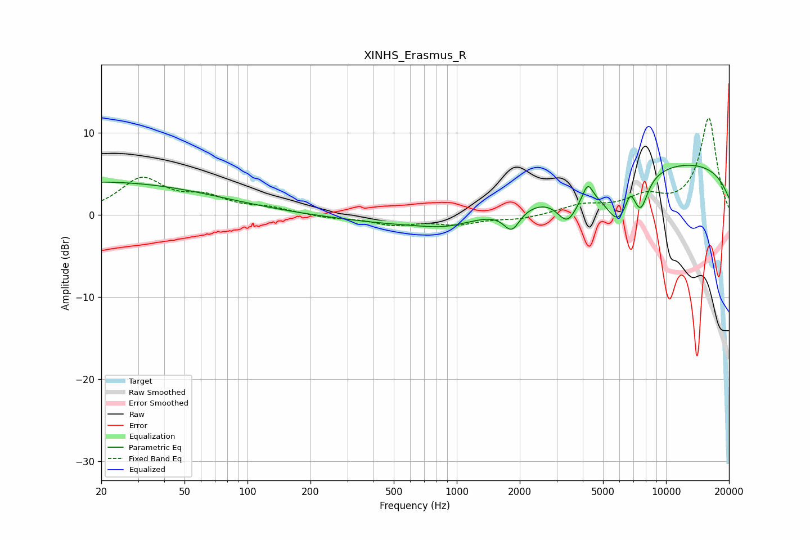

# XINHS_Erasmus_R
See [usage instructions](https://github.com/jaakkopasanen/AutoEq#usage) for more options and info.

### Parametric EQs
Apply preamp of -6.1 dB when using parametric equalizer.

|   # | Type    |   Fc (Hz) |    Q |   Gain (dB) |
|-----|---------|-----------|------|-------------|
|   1 | Peaking |        20 | 0.26 |         4   |
|   2 | Peaking |       886 | 1.34 |        -0.6 |
|   3 | Peaking |      1326 | 0.25 |        -1.9 |
|   4 | Peaking |      1832 | 3.62 |        -2.6 |
|   5 | Peaking |      3380 | 2.82 |        -3.5 |
|   6 | Peaking |      4226 | 6    |         2   |
|   7 | Peaking |      5950 | 2.01 |        -5.7 |
|   8 | Peaking |      6741 | 5.47 |         2.2 |
|   9 | Peaking |      7575 | 3.94 |        -3.3 |
|  10 | Peaking |      9337 | 0.18 |         6.7 |

### Fixed Band EQs
When using fixed band (also called graphic) equalizer, apply preamp of **-11.9 dB** (if available) and set gains manually with these parameters.

|   # | Type    |   Fc (Hz) |    Q |   Gain (dB) |
|-----|---------|-----------|------|-------------|
|   1 | Peaking |        31 | 1.41 |         4.2 |
|   2 | Peaking |        62 | 1.41 |         1.8 |
|   3 | Peaking |       125 | 1.41 |         0.7 |
|   4 | Peaking |       250 | 1.41 |        -0.4 |
|   5 | Peaking |       500 | 1.41 |        -1.1 |
|   6 | Peaking |      1000 | 1.41 |        -1   |
|   7 | Peaking |      2000 | 1.41 |        -0.5 |
|   8 | Peaking |      4000 | 1.41 |         1.1 |
|   9 | Peaking |      8000 | 1.41 |         1.9 |
|  10 | Peaking |     16000 | 1.41 |        11.7 |

### Graphs

