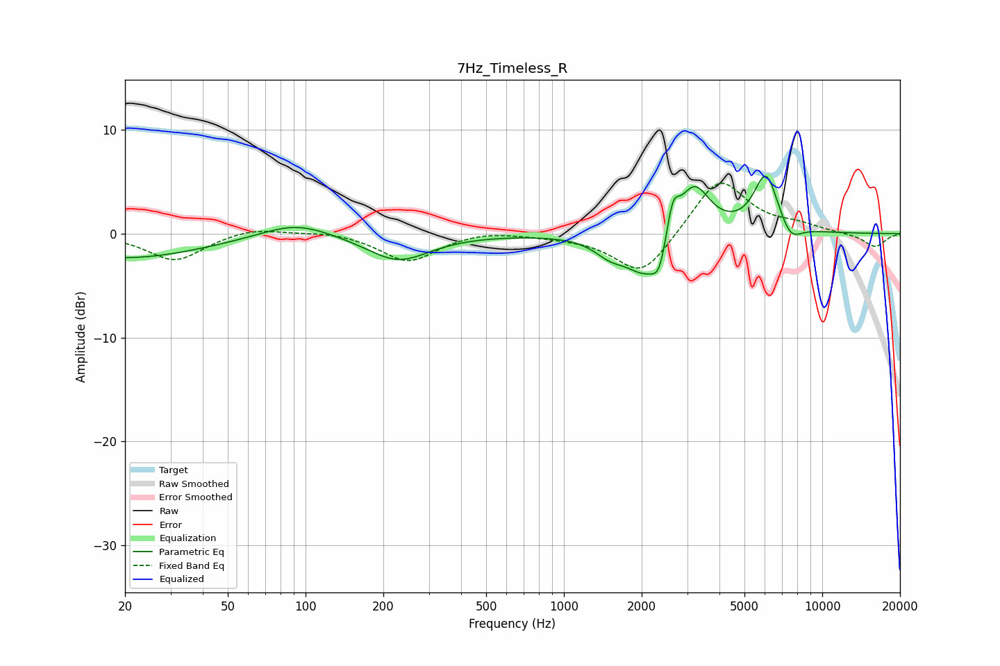

# 7Hz_Timeless_R
See [usage instructions](https://github.com/jaakkopasanen/AutoEq#usage) for more options and info.

### Parametric EQs
Apply preamp of -5.6 dB when using parametric equalizer.

|   # | Type    |   Fc (Hz) |    Q |   Gain (dB) |
|-----|---------|-----------|------|-------------|
|   1 | Peaking |        20 | 0.46 |        -2.4 |
|   2 | Peaking |        91 | 1.06 |         1.5 |
|   3 | Peaking |       228 | 1.16 |        -2.6 |
|   4 | Peaking |      1512 | 2.28 |        -1.5 |
|   5 | Peaking |      2058 | 1.9  |        -3.7 |
|   6 | Peaking |      2343 | 4.99 |        -2.7 |
|   7 | Peaking |      2636 | 5.89 |         3.2 |
|   8 | Peaking |      3185 | 2.28 |         5   |
|   9 | Peaking |      6057 | 2.88 |         5.7 |
|  10 | Peaking |      7532 | 3.27 |        -1.7 |

### Fixed Band EQs
When using fixed band (also called graphic) equalizer, apply preamp of **-4.9 dB** (if available) and set gains manually with these parameters.

|   # | Type    |   Fc (Hz) |    Q |   Gain (dB) |
|-----|---------|-----------|------|-------------|
|   1 | Peaking |        31 | 1.41 |        -2.6 |
|   2 | Peaking |        62 | 1.41 |         0.7 |
|   3 | Peaking |       125 | 1.41 |         0.3 |
|   4 | Peaking |       250 | 1.41 |        -2.7 |
|   5 | Peaking |       500 | 1.41 |         0.4 |
|   6 | Peaking |      1000 | 1.41 |        -0.2 |
|   7 | Peaking |      2000 | 1.41 |        -4.2 |
|   8 | Peaking |      4000 | 1.41 |         5.5 |
|   9 | Peaking |      8000 | 1.41 |         0.6 |
|  10 | Peaking |     16000 | 1.41 |        -1.3 |

### Graphs

