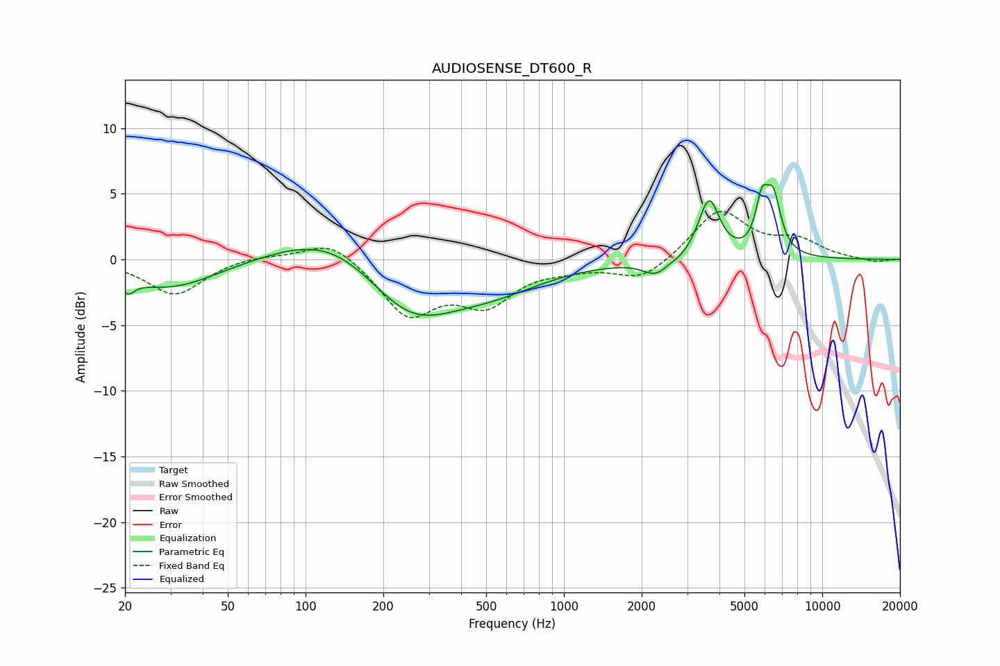

# AUDIOSENSE_DT600_R
See [usage instructions](https://github.com/jaakkopasanen/AutoEq#usage) for more options and info.

### Parametric EQs
Apply preamp of -5.8 dB when using parametric equalizer.

|   # | Type    |   Fc (Hz) |    Q |   Gain (dB) |
|-----|---------|-----------|------|-------------|
|   1 | Peaking |        21 | 5.5  |        -1.1 |
|   2 | Peaking |        30 | 0.76 |        -2.2 |
|   3 | Peaking |       129 | 0.67 |         2.7 |
|   4 | Peaking |       253 | 0.79 |        -4.5 |
|   5 | Peaking |       535 | 0.71 |        -1.8 |
|   6 | Peaking |      2265 | 2.91 |        -1.1 |
|   7 | Peaking |      2845 | 4.53 |        -0.2 |
|   8 | Peaking |      3647 | 3.47 |         4.5 |
|   9 | Peaking |      5835 | 5.78 |         3.3 |
|  10 | Peaking |      6463 | 4.64 |         4.1 |

### Fixed Band EQs
When using fixed band (also called graphic) equalizer, apply preamp of **-3.8 dB** (if available) and set gains manually with these parameters.

|   # | Type    |   Fc (Hz) |    Q |   Gain (dB) |
|-----|---------|-----------|------|-------------|
|   1 | Peaking |        31 | 1.41 |        -2.7 |
|   2 | Peaking |        62 | 1.41 |         0.4 |
|   3 | Peaking |       125 | 1.41 |         1.7 |
|   4 | Peaking |       250 | 1.41 |        -4.1 |
|   5 | Peaking |       500 | 1.41 |        -3.1 |
|   6 | Peaking |      1000 | 1.41 |        -0.4 |
|   7 | Peaking |      2000 | 1.41 |        -1.6 |
|   8 | Peaking |      4000 | 1.41 |         3.8 |
|   9 | Peaking |      8000 | 1.41 |         1.3 |
|  10 | Peaking |     16000 | 1.41 |        -0.2 |

### Graphs

