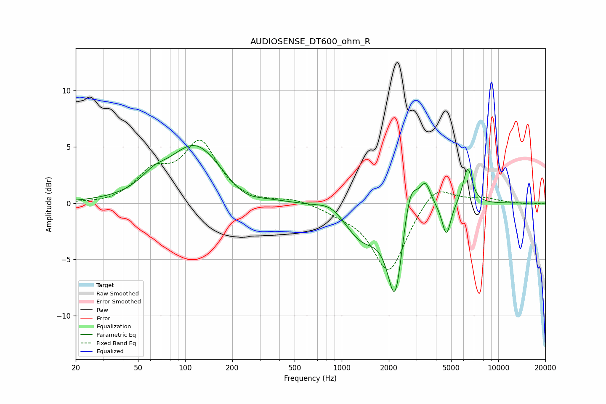

# AUDIOSENSE_DT600_ohm_R
See [usage instructions](https://github.com/jaakkopasanen/AutoEq#usage) for more options and info.

### Parametric EQs
Apply preamp of -5.2 dB when using parametric equalizer.

|   # | Type    |   Fc (Hz) |    Q |   Gain (dB) |
|-----|---------|-----------|------|-------------|
|   1 | Peaking |        63 | 1.75 |         1   |
|   2 | Peaking |       116 | 0.84 |         5.1 |
|   3 | Peaking |       237 | 1.4  |        -0.9 |
|   4 | Peaking |       866 | 1.6  |         1   |
|   5 | Peaking |      1347 | 1.16 |        -3.1 |
|   6 | Peaking |      2196 | 2.88 |        -8   |
|   7 | Peaking |      2736 | 2.98 |         3.7 |
|   8 | Peaking |      3430 | 4.14 |         2.1 |
|   9 | Peaking |      4665 | 5.06 |        -2.9 |
|  10 | Peaking |      6376 | 4.61 |         3.3 |

### Fixed Band EQs
When using fixed band (also called graphic) equalizer, apply preamp of **-5.7 dB** (if available) and set gains manually with these parameters.

|   # | Type    |   Fc (Hz) |    Q |   Gain (dB) |
|-----|---------|-----------|------|-------------|
|   1 | Peaking |        31 | 1.41 |        -0.1 |
|   2 | Peaking |        62 | 1.41 |         2.5 |
|   3 | Peaking |       125 | 1.41 |         5.2 |
|   4 | Peaking |       250 | 1.41 |        -0.1 |
|   5 | Peaking |       500 | 1.41 |         0.4 |
|   6 | Peaking |      1000 | 1.41 |        -0.6 |
|   7 | Peaking |      2000 | 1.41 |        -6.1 |
|   8 | Peaking |      4000 | 1.41 |         1.9 |
|   9 | Peaking |      8000 | 1.41 |         0.4 |
|  10 | Peaking |     16000 | 1.41 |        -0.1 |

### Graphs

