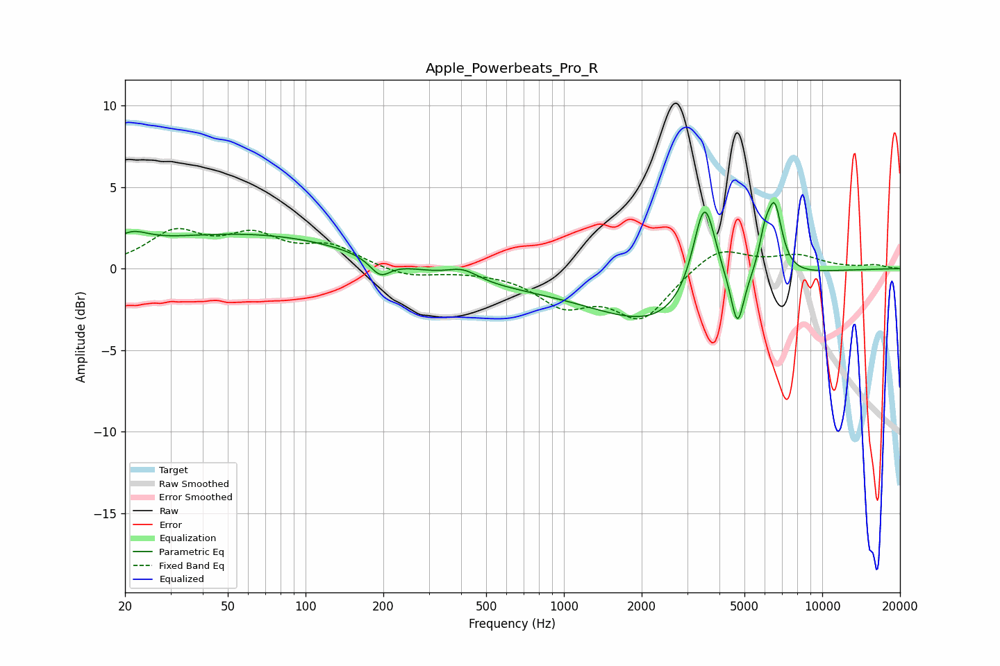

# Apple_Powerbeats_Pro_R
See [usage instructions](https://github.com/jaakkopasanen/AutoEq#usage) for more options and info.

### Parametric EQs
Apply preamp of -4.2 dB when using parametric equalizer.

|   # | Type    |   Fc (Hz) |    Q |   Gain (dB) |
|-----|---------|-----------|------|-------------|
|   1 | Peaking |        21 | 2.14 |         0.9 |
|   2 | Peaking |        63 | 0.29 |         2.2 |
|   3 | Peaking |       195 | 3.6  |        -1   |
|   4 | Peaking |       407 | 2.34 |         0.7 |
|   5 | Peaking |       532 | 0.32 |        -1   |
|   6 | Peaking |      2351 | 0.6  |        -3.1 |
|   7 | Peaking |      3500 | 3.12 |         6.2 |
|   8 | Peaking |      4697 | 5.73 |        -3.1 |
|   9 | Peaking |      5991 | 5.82 |         1.8 |
|  10 | Peaking |      6547 | 4.72 |         4.1 |

### Fixed Band EQs
When using fixed band (also called graphic) equalizer, apply preamp of **-2.6 dB** (if available) and set gains manually with these parameters.

|   # | Type    |   Fc (Hz) |    Q |   Gain (dB) |
|-----|---------|-----------|------|-------------|
|   1 | Peaking |        31 | 1.41 |         2.1 |
|   2 | Peaking |        62 | 1.41 |         1.8 |
|   3 | Peaking |       125 | 1.41 |         1.3 |
|   4 | Peaking |       250 | 1.41 |        -0.5 |
|   5 | Peaking |       500 | 1.41 |        -0.1 |
|   6 | Peaking |      1000 | 1.41 |        -2   |
|   7 | Peaking |      2000 | 1.41 |        -3   |
|   8 | Peaking |      4000 | 1.41 |         1.4 |
|   9 | Peaking |      8000 | 1.41 |         0.8 |
|  10 | Peaking |     16000 | 1.41 |         0.2 |

### Graphs

