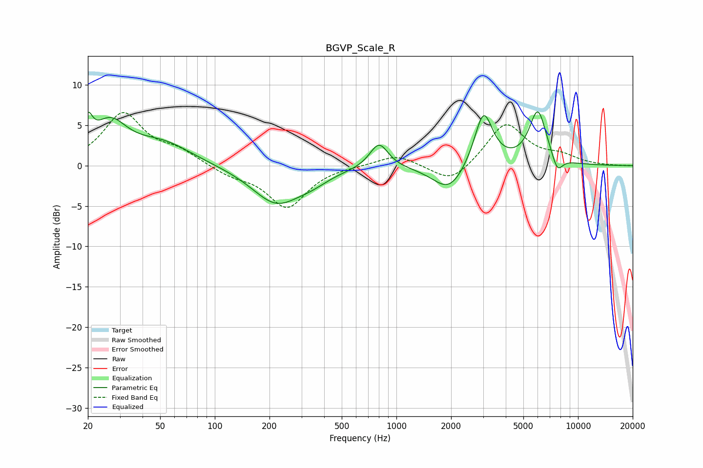

# BGVP_Scale_R
See [usage instructions](https://github.com/jaakkopasanen/AutoEq#usage) for more options and info.

### Parametric EQs
Apply preamp of -6.8 dB when using parametric equalizer.

|   # | Type    |   Fc (Hz) |    Q |   Gain (dB) |
|-----|---------|-----------|------|-------------|
|   1 | Peaking |        20 | 5.78 |         3.2 |
|   2 | Peaking |        26 | 1.48 |         4.8 |
|   3 | Peaking |        52 | 0.88 |         2.6 |
|   4 | Peaking |       218 | 1.04 |        -4.6 |
|   5 | Peaking |       344 | 1.54 |        -0.9 |
|   6 | Peaking |       802 | 2.76 |         3.2 |
|   7 | Peaking |      1954 | 1.57 |        -3.4 |
|   8 | Peaking |      3017 | 2.75 |         7   |
|   9 | Peaking |      6007 | 2.85 |         6.7 |
|  10 | Peaking |      7691 | 4.49 |        -2.1 |

### Fixed Band EQs
When using fixed band (also called graphic) equalizer, apply preamp of **-6.7 dB** (if available) and set gains manually with these parameters.

|   # | Type    |   Fc (Hz) |    Q |   Gain (dB) |
|-----|---------|-----------|------|-------------|
|   1 | Peaking |        31 | 1.41 |         6.4 |
|   2 | Peaking |        62 | 1.41 |         1.6 |
|   3 | Peaking |       125 | 1.41 |        -1.1 |
|   4 | Peaking |       250 | 1.41 |        -5.1 |
|   5 | Peaking |       500 | 1.41 |         0   |
|   6 | Peaking |      1000 | 1.41 |         1.4 |
|   7 | Peaking |      2000 | 1.41 |        -2.4 |
|   8 | Peaking |      4000 | 1.41 |         5.3 |
|   9 | Peaking |      8000 | 1.41 |         1   |
|  10 | Peaking |     16000 | 1.41 |        -0   |

### Graphs

