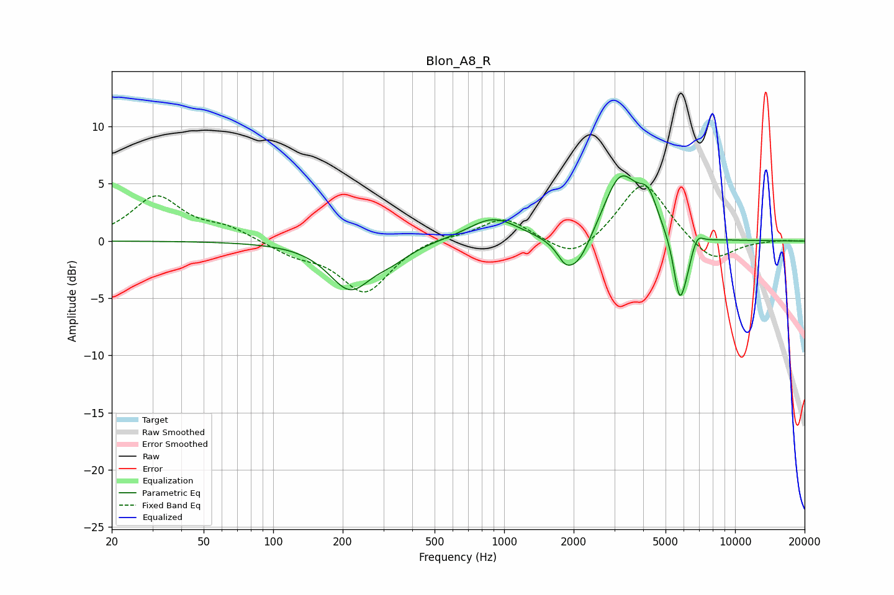

# Blon_A8_R
See [usage instructions](https://github.com/jaakkopasanen/AutoEq#usage) for more options and info.

### Parametric EQs
Apply preamp of -5.8 dB when using parametric equalizer.

|   # | Type    |   Fc (Hz) |    Q |   Gain (dB) |
|-----|---------|-----------|------|-------------|
|   1 | Peaking |       215 | 1.53 |        -4.1 |
|   2 | Peaking |       327 | 1.78 |        -0.9 |
|   3 | Peaking |       897 | 1.3  |         2   |
|   4 | Peaking |      1826 | 4.68 |        -0.9 |
|   5 | Peaking |      2059 | 2.23 |        -3.3 |
|   6 | Peaking |      3192 | 1.84 |         5.8 |
|   7 | Peaking |      4210 | 3.43 |         2.6 |
|   8 | Peaking |      5746 | 5.22 |        -5.4 |
|   9 | Peaking |      6174 | 6    |        -1.2 |
|  10 | Peaking |      6883 | 6    |         0.9 |

### Fixed Band EQs
When using fixed band (also called graphic) equalizer, apply preamp of **-4.9 dB** (if available) and set gains manually with these parameters.

|   # | Type    |   Fc (Hz) |    Q |   Gain (dB) |
|-----|---------|-----------|------|-------------|
|   1 | Peaking |        31 | 1.41 |         3.8 |
|   2 | Peaking |        62 | 1.41 |         1   |
|   3 | Peaking |       125 | 1.41 |        -1   |
|   4 | Peaking |       250 | 1.41 |        -4.5 |
|   5 | Peaking |       500 | 1.41 |         0.4 |
|   6 | Peaking |      1000 | 1.41 |         2.1 |
|   7 | Peaking |      2000 | 1.41 |        -1.9 |
|   8 | Peaking |      4000 | 1.41 |         5.4 |
|   9 | Peaking |      8000 | 1.41 |        -2   |
|  10 | Peaking |     16000 | 1.41 |         0.1 |

### Graphs

