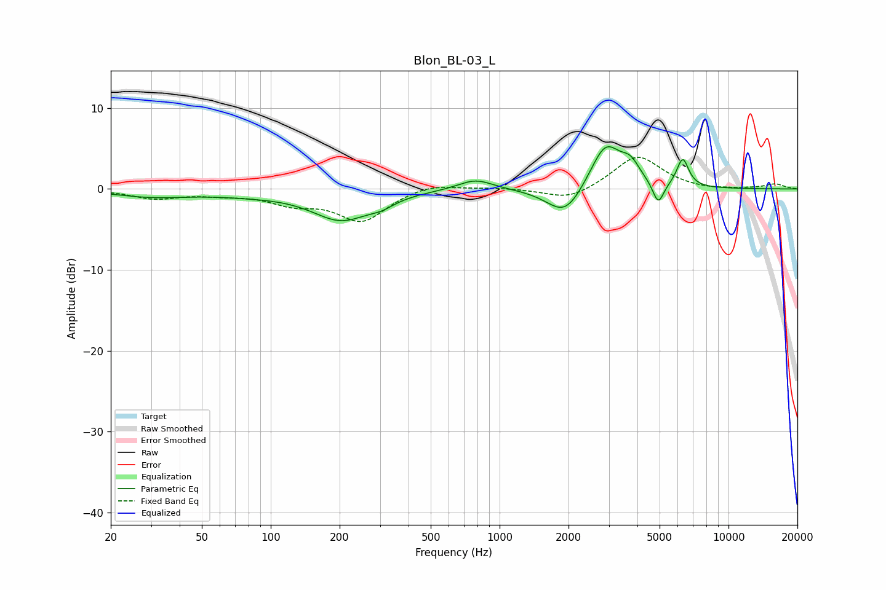

# Blon_BL-03_L
See [usage instructions](https://github.com/jaakkopasanen/AutoEq#usage) for more options and info.

### Parametric EQs
Apply preamp of -5.3 dB when using parametric equalizer.

|   # | Type    |   Fc (Hz) |    Q |   Gain (dB) |
|-----|---------|-----------|------|-------------|
|   1 | Peaking |        30 | 0.86 |        -0.9 |
|   2 | Peaking |        80 | 0.77 |        -0.5 |
|   3 | Peaking |       203 | 1.1  |        -3.6 |
|   4 | Peaking |       306 | 2.51 |        -0.8 |
|   5 | Peaking |       784 | 1.83 |         1.4 |
|   6 | Peaking |      1934 | 1.79 |        -3.7 |
|   7 | Peaking |      2903 | 2.05 |         5.8 |
|   8 | Peaking |      3734 | 3.46 |         2   |
|   9 | Peaking |      4933 | 5.77 |        -2.8 |
|  10 | Peaking |      6310 | 5.32 |         3.5 |

### Fixed Band EQs
When using fixed band (also called graphic) equalizer, apply preamp of **-4.0 dB** (if available) and set gains manually with these parameters.

|   # | Type    |   Fc (Hz) |    Q |   Gain (dB) |
|-----|---------|-----------|------|-------------|
|   1 | Peaking |        31 | 1.41 |        -1.1 |
|   2 | Peaking |        62 | 1.41 |        -0.5 |
|   3 | Peaking |       125 | 1.41 |        -1.6 |
|   4 | Peaking |       250 | 1.41 |        -3.9 |
|   5 | Peaking |       500 | 1.41 |         0.8 |
|   6 | Peaking |      1000 | 1.41 |         0.2 |
|   7 | Peaking |      2000 | 1.41 |        -1.5 |
|   8 | Peaking |      4000 | 1.41 |         4.2 |
|   9 | Peaking |      8000 | 1.41 |        -0.2 |
|  10 | Peaking |     16000 | 1.41 |         0.6 |

### Graphs

