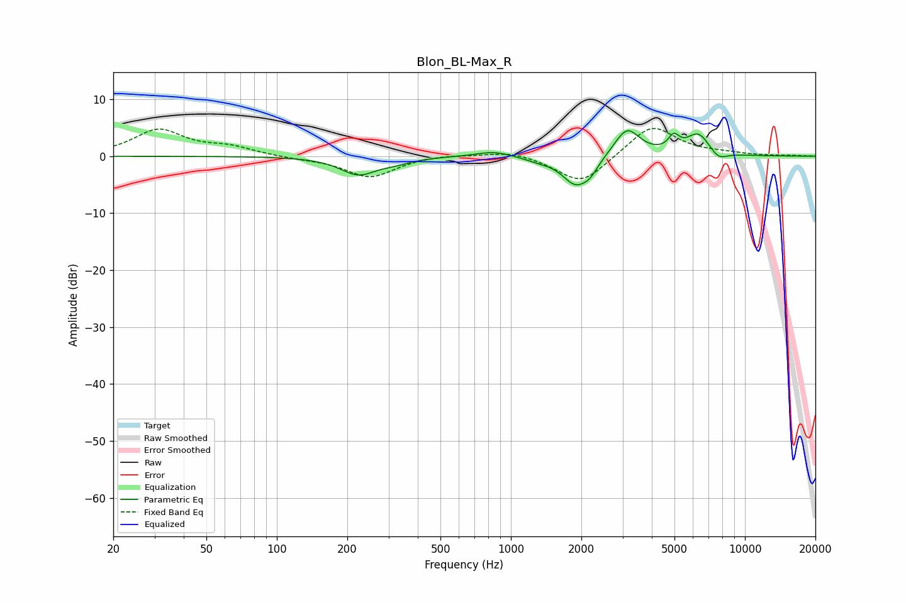

# Blon_BL-Max_R
See [usage instructions](https://github.com/jaakkopasanen/AutoEq#usage) for more options and info.

### Parametric EQs
Apply preamp of -4.6 dB when using parametric equalizer.

|   # | Type    |   Fc (Hz) |    Q |   Gain (dB) |
|-----|---------|-----------|------|-------------|
|   1 | Peaking |       223 | 1.8  |        -3.1 |
|   2 | Peaking |       324 | 2.19 |        -0.7 |
|   3 | Peaking |       845 | 1.84 |         1   |
|   4 | Peaking |      1303 | 2.43 |        -0.5 |
|   5 | Peaking |      1891 | 2.42 |        -4.9 |
|   6 | Peaking |      2186 | 4.15 |        -1.7 |
|   7 | Peaking |      3134 | 2.6  |         5   |
|   8 | Peaking |      4965 | 6    |         2.4 |
|   9 | Peaking |      6322 | 2.66 |         3.9 |
|  10 | Peaking |      7695 | 3.56 |        -1.6 |

### Fixed Band EQs
When using fixed band (also called graphic) equalizer, apply preamp of **-5.0 dB** (if available) and set gains manually with these parameters.

|   # | Type    |   Fc (Hz) |    Q |   Gain (dB) |
|-----|---------|-----------|------|-------------|
|   1 | Peaking |        31 | 1.41 |         4.5 |
|   2 | Peaking |        62 | 1.41 |         1.4 |
|   3 | Peaking |       125 | 1.41 |        -0.3 |
|   4 | Peaking |       250 | 1.41 |        -3.7 |
|   5 | Peaking |       500 | 1.41 |         0.4 |
|   6 | Peaking |      1000 | 1.41 |         1   |
|   7 | Peaking |      2000 | 1.41 |        -5.1 |
|   8 | Peaking |      4000 | 1.41 |         5.7 |
|   9 | Peaking |      8000 | 1.41 |         0.4 |
|  10 | Peaking |     16000 | 1.41 |         0.1 |

### Graphs

