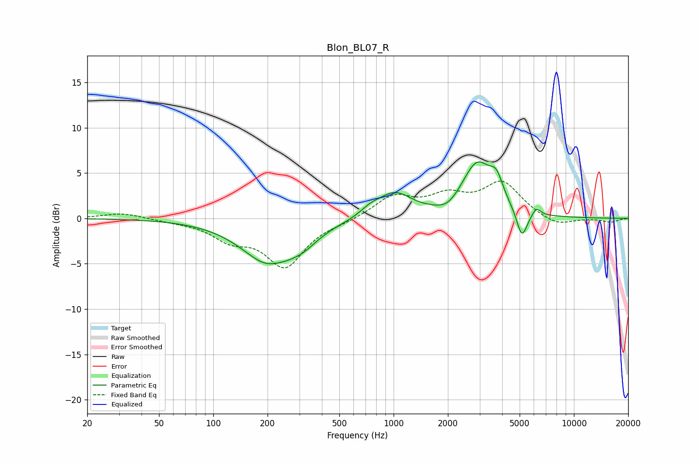

# Blon_BL07_R
See [usage instructions](https://github.com/jaakkopasanen/AutoEq#usage) for more options and info.

### Parametric EQs
Apply preamp of -6.3 dB when using parametric equalizer.

|   # | Type    |   Fc (Hz) |    Q |   Gain (dB) |
|-----|---------|-----------|------|-------------|
|   1 | Peaking |       209 | 0.92 |        -5.1 |
|   2 | Peaking |       224 | 2.8  |         0.3 |
|   3 | Peaking |       317 | 1.93 |        -0.9 |
|   4 | Peaking |       743 | 2.56 |         0.7 |
|   5 | Peaking |      1012 | 1.47 |         2.7 |
|   6 | Peaking |      1997 | 2.29 |        -0.9 |
|   7 | Peaking |      2909 | 1.64 |         5.9 |
|   8 | Peaking |      3721 | 3.92 |         2.2 |
|   9 | Peaking |      5148 | 4.69 |        -3.1 |
|  10 | Peaking |      6195 | 6    |         0.9 |

### Fixed Band EQs
When using fixed band (also called graphic) equalizer, apply preamp of **-4.2 dB** (if available) and set gains manually with these parameters.

|   # | Type    |   Fc (Hz) |    Q |   Gain (dB) |
|-----|---------|-----------|------|-------------|
|   1 | Peaking |        31 | 1.41 |         0.6 |
|   2 | Peaking |        62 | 1.41 |        -0.2 |
|   3 | Peaking |       125 | 1.41 |        -2   |
|   4 | Peaking |       250 | 1.41 |        -5.1 |
|   5 | Peaking |       500 | 1.41 |        -0.3 |
|   6 | Peaking |      1000 | 1.41 |         2.4 |
|   7 | Peaking |      2000 | 1.41 |         2.1 |
|   8 | Peaking |      4000 | 1.41 |         3.8 |
|   9 | Peaking |      8000 | 1.41 |        -1   |
|  10 | Peaking |     16000 | 1.41 |        -0.4 |

### Graphs

