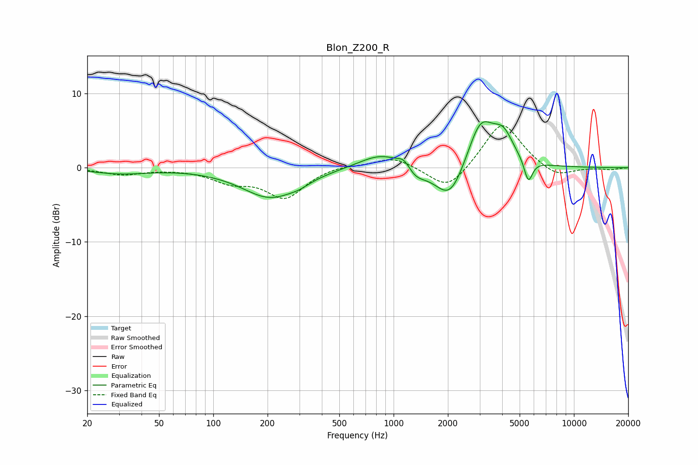

# Blon_Z200_R
See [usage instructions](https://github.com/jaakkopasanen/AutoEq#usage) for more options and info.

### Parametric EQs
Apply preamp of -6.3 dB when using parametric equalizer.

|   # | Type    |   Fc (Hz) |    Q |   Gain (dB) |
|-----|---------|-----------|------|-------------|
|   1 | Peaking |        31 | 0.93 |        -0.7 |
|   2 | Peaking |       207 | 0.9  |        -4   |
|   3 | Peaking |       301 | 2.53 |        -0.4 |
|   4 | Peaking |       863 | 1.14 |         2.1 |
|   5 | Peaking |      1144 | 4.2  |         1.2 |
|   6 | Peaking |      1320 | 2.48 |        -1.5 |
|   7 | Peaking |      2061 | 1.68 |        -5.3 |
|   8 | Peaking |      3039 | 1.82 |         6.7 |
|   9 | Peaking |      4066 | 2.5  |         3.3 |
|  10 | Peaking |      5587 | 6    |        -3.1 |

### Fixed Band EQs
When using fixed band (also called graphic) equalizer, apply preamp of **-5.8 dB** (if available) and set gains manually with these parameters.

|   # | Type    |   Fc (Hz) |    Q |   Gain (dB) |
|-----|---------|-----------|------|-------------|
|   1 | Peaking |        31 | 1.41 |        -0.9 |
|   2 | Peaking |        62 | 1.41 |        -0.1 |
|   3 | Peaking |       125 | 1.41 |        -1.7 |
|   4 | Peaking |       250 | 1.41 |        -3.9 |
|   5 | Peaking |       500 | 1.41 |         0.5 |
|   6 | Peaking |      1000 | 1.41 |         1.5 |
|   7 | Peaking |      2000 | 1.41 |        -3.3 |
|   8 | Peaking |      4000 | 1.41 |         6.4 |
|   9 | Peaking |      8000 | 1.41 |        -1.5 |
|  10 | Peaking |     16000 | 1.41 |        -0.3 |

### Graphs

