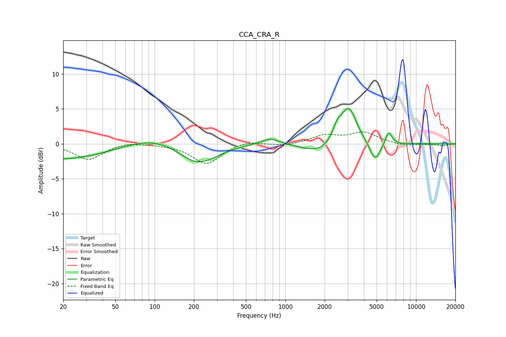

# CCA_CRA_R
See [usage instructions](https://github.com/jaakkopasanen/AutoEq#usage) for more options and info.

### Parametric EQs
Apply preamp of -5.1 dB when using parametric equalizer.

|   # | Type    |   Fc (Hz) |    Q |   Gain (dB) |
|-----|---------|-----------|------|-------------|
|   1 | Peaking |        38 | 0.21 |        -2.9 |
|   2 | Peaking |       110 | 0.43 |         3.8 |
|   3 | Peaking |       211 | 0.89 |        -4   |
|   4 | Peaking |       698 | 2.8  |        -0.6 |
|   5 | Peaking |       739 | 2.05 |         1.5 |
|   6 | Peaking |      1850 | 1.14 |        -1.5 |
|   7 | Peaking |      2503 | 3.75 |         1.9 |
|   8 | Peaking |      3062 | 2.31 |         5.3 |
|   9 | Peaking |      4852 | 3.36 |        -2.8 |
|  10 | Peaking |      6176 | 5.72 |         1.9 |

### Fixed Band EQs
When using fixed band (also called graphic) equalizer, apply preamp of **-1.8 dB** (if available) and set gains manually with these parameters.

|   # | Type    |   Fc (Hz) |    Q |   Gain (dB) |
|-----|---------|-----------|------|-------------|
|   1 | Peaking |        31 | 1.41 |        -2.3 |
|   2 | Peaking |        62 | 1.41 |         0.4 |
|   3 | Peaking |       125 | 1.41 |        -0   |
|   4 | Peaking |       250 | 1.41 |        -2.9 |
|   5 | Peaking |       500 | 1.41 |         0.5 |
|   6 | Peaking |      1000 | 1.41 |        -0.3 |
|   7 | Peaking |      2000 | 1.41 |         1.1 |
|   8 | Peaking |      4000 | 1.41 |         1.6 |
|   9 | Peaking |      8000 | 1.41 |        -0.3 |
|  10 | Peaking |     16000 | 1.41 |        -0.3 |

### Graphs

