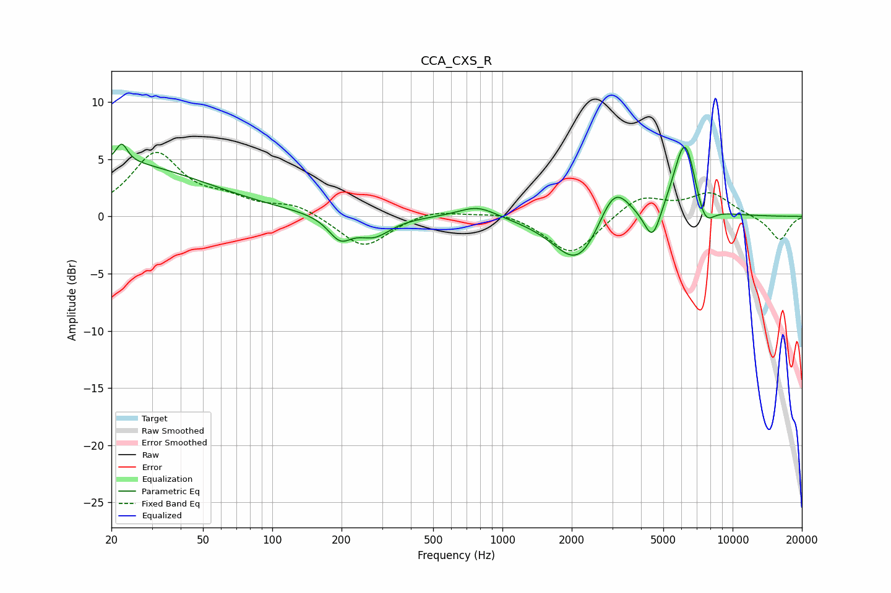

# CCA_CXS_R
See [usage instructions](https://github.com/jaakkopasanen/AutoEq#usage) for more options and info.

### Parametric EQs
Apply preamp of -6.4 dB when using parametric equalizer.

|   # | Type    |   Fc (Hz) |    Q |   Gain (dB) |
|-----|---------|-----------|------|-------------|
|   1 | Peaking |        20 | 0.35 |         4.7 |
|   2 | Peaking |        22 | 5.86 |         1.6 |
|   3 | Peaking |       197 | 2.79 |        -1.9 |
|   4 | Peaking |       276 | 1.91 |        -1.7 |
|   5 | Peaking |       779 | 1.67 |         1.1 |
|   6 | Peaking |      2137 | 1.34 |        -4.5 |
|   7 | Peaking |      3052 | 2.05 |         3.7 |
|   8 | Peaking |      4491 | 3.78 |        -3   |
|   9 | Peaking |      6211 | 2.67 |         7.2 |
|  10 | Peaking |      7532 | 3.24 |        -2.5 |

### Fixed Band EQs
When using fixed band (also called graphic) equalizer, apply preamp of **-5.7 dB** (if available) and set gains manually with these parameters.

|   # | Type    |   Fc (Hz) |    Q |   Gain (dB) |
|-----|---------|-----------|------|-------------|
|   1 | Peaking |        31 | 1.41 |         5.4 |
|   2 | Peaking |        62 | 1.41 |         1.2 |
|   3 | Peaking |       125 | 1.41 |         1   |
|   4 | Peaking |       250 | 1.41 |        -2.8 |
|   5 | Peaking |       500 | 1.41 |         0.7 |
|   6 | Peaking |      1000 | 1.41 |         0.5 |
|   7 | Peaking |      2000 | 1.41 |        -3.4 |
|   8 | Peaking |      4000 | 1.41 |         1.8 |
|   9 | Peaking |      8000 | 1.41 |         2   |
|  10 | Peaking |     16000 | 1.41 |        -2.1 |

### Graphs

