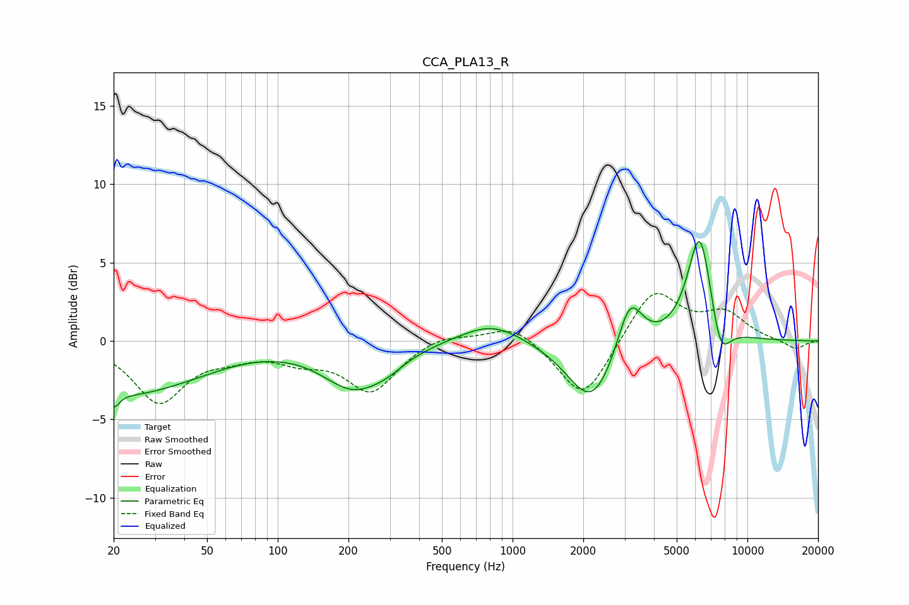

# CCA_PLA13_R
See [usage instructions](https://github.com/jaakkopasanen/AutoEq#usage) for more options and info.

### Parametric EQs
Apply preamp of -6.4 dB when using parametric equalizer.

|   # | Type    |   Fc (Hz) |    Q |   Gain (dB) |
|-----|---------|-----------|------|-------------|
|   1 | Peaking |        20 | 5.77 |        -1.2 |
|   2 | Peaking |        22 | 0.79 |        -2.4 |
|   3 | Peaking |        40 | 0.67 |        -1.3 |
|   4 | Peaking |       209 | 1.09 |        -2.7 |
|   5 | Peaking |       291 | 1.69 |        -0.7 |
|   6 | Peaking |       814 | 1.07 |         1.3 |
|   7 | Peaking |      2180 | 1.37 |        -4.2 |
|   8 | Peaking |      3154 | 2.62 |         3.5 |
|   9 | Peaking |      6278 | 2.57 |         7.2 |
|  10 | Peaking |      7657 | 3.16 |        -2.7 |

### Fixed Band EQs
When using fixed band (also called graphic) equalizer, apply preamp of **-3.1 dB** (if available) and set gains manually with these parameters.

|   # | Type    |   Fc (Hz) |    Q |   Gain (dB) |
|-----|---------|-----------|------|-------------|
|   1 | Peaking |        31 | 1.41 |        -3.8 |
|   2 | Peaking |        62 | 1.41 |        -0.7 |
|   3 | Peaking |       125 | 1.41 |        -1   |
|   4 | Peaking |       250 | 1.41 |        -3.1 |
|   5 | Peaking |       500 | 1.41 |         0.5 |
|   6 | Peaking |      1000 | 1.41 |         1.2 |
|   7 | Peaking |      2000 | 1.41 |        -3.9 |
|   8 | Peaking |      4000 | 1.41 |         3.4 |
|   9 | Peaking |      8000 | 1.41 |         1.6 |
|  10 | Peaking |     16000 | 1.41 |        -0.6 |

### Graphs

