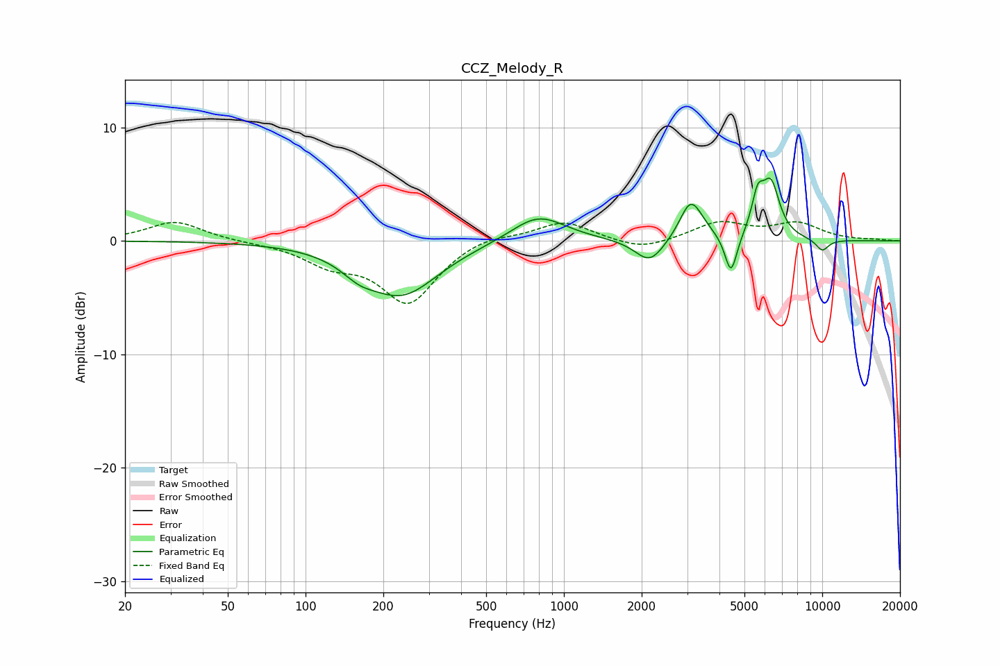

# CCZ_Melody_R
See [usage instructions](https://github.com/jaakkopasanen/AutoEq#usage) for more options and info.

### Parametric EQs
Apply preamp of -5.6 dB when using parametric equalizer.

|   # | Type    |   Fc (Hz) |    Q |   Gain (dB) |
|-----|---------|-----------|------|-------------|
|   1 | Peaking |       161 | 2.15 |        -1.1 |
|   2 | Peaking |       236 | 1    |        -4.7 |
|   3 | Peaking |       795 | 1.33 |         2.4 |
|   4 | Peaking |      2151 | 2.49 |        -2.2 |
|   5 | Peaking |      3078 | 3.46 |         2.8 |
|   6 | Peaking |      3262 | 2.67 |         1   |
|   7 | Peaking |      4434 | 5.95 |        -3.6 |
|   8 | Peaking |      5624 | 5.89 |         3   |
|   9 | Peaking |      6329 | 4.02 |         4.7 |
|  10 | Peaking |     10000 | 4.84 |        -1   |

### Fixed Band EQs
When using fixed band (also called graphic) equalizer, apply preamp of **-1.8 dB** (if available) and set gains manually with these parameters.

|   # | Type    |   Fc (Hz) |    Q |   Gain (dB) |
|-----|---------|-----------|------|-------------|
|   1 | Peaking |        31 | 1.41 |         1.7 |
|   2 | Peaking |        62 | 1.41 |        -0.1 |
|   3 | Peaking |       125 | 1.41 |        -1.7 |
|   4 | Peaking |       250 | 1.41 |        -5.4 |
|   5 | Peaking |       500 | 1.41 |         0.7 |
|   6 | Peaking |      1000 | 1.41 |         1.7 |
|   7 | Peaking |      2000 | 1.41 |        -0.9 |
|   8 | Peaking |      4000 | 1.41 |         1.6 |
|   9 | Peaking |      8000 | 1.41 |         1.5 |
|  10 | Peaking |     16000 | 1.41 |         0.1 |

### Graphs

