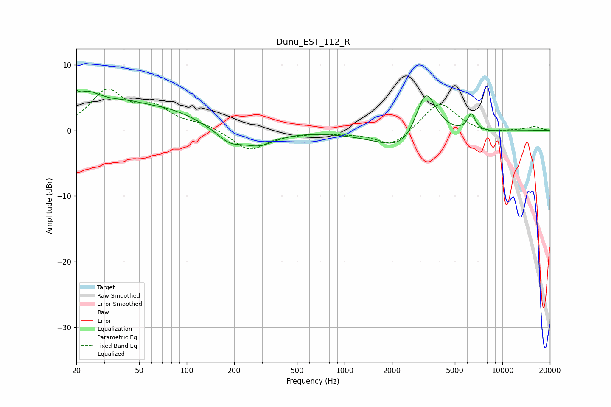

# Dunu_EST_112_R
See [usage instructions](https://github.com/jaakkopasanen/AutoEq#usage) for more options and info.

### Parametric EQs
Apply preamp of -6.2 dB when using parametric equalizer.

|   # | Type    |   Fc (Hz) |    Q |   Gain (dB) |
|-----|---------|-----------|------|-------------|
|   1 | Peaking |        20 | 0.95 |         5.9 |
|   2 | Peaking |        21 | 5.87 |        -3.9 |
|   3 | Peaking |        22 | 5.99 |         3.2 |
|   4 | Peaking |        42 | 1.1  |         1.5 |
|   5 | Peaking |        76 | 0.71 |         2.5 |
|   6 | Peaking |       186 | 1.75 |        -1.9 |
|   7 | Peaking |       286 | 1.33 |        -2.1 |
|   8 | Peaking |      2768 | 0.85 |        -6.8 |
|   9 | Peaking |      3249 | 1.67 |        11.4 |
|  10 | Peaking |      6366 | 5.47 |         2.6 |

### Fixed Band EQs
When using fixed band (also called graphic) equalizer, apply preamp of **-6.4 dB** (if available) and set gains manually with these parameters.

|   # | Type    |   Fc (Hz) |    Q |   Gain (dB) |
|-----|---------|-----------|------|-------------|
|   1 | Peaking |        31 | 1.41 |         5.7 |
|   2 | Peaking |        62 | 1.41 |         3   |
|   3 | Peaking |       125 | 1.41 |         0.9 |
|   4 | Peaking |       250 | 1.41 |        -3   |
|   5 | Peaking |       500 | 1.41 |        -0.3 |
|   6 | Peaking |      1000 | 1.41 |        -0.3 |
|   7 | Peaking |      2000 | 1.41 |        -2.5 |
|   8 | Peaking |      4000 | 1.41 |         4.5 |
|   9 | Peaking |      8000 | 1.41 |        -0.6 |
|  10 | Peaking |     16000 | 1.41 |         0.6 |

### Graphs

