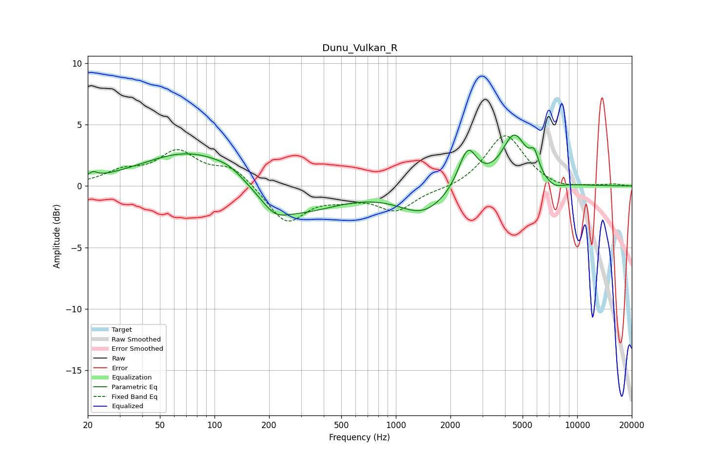

# Dunu_Vulkan_R
See [usage instructions](https://github.com/jaakkopasanen/AutoEq#usage) for more options and info.

### Parametric EQs
Apply preamp of -4.2 dB when using parametric equalizer.

|   # | Type    |   Fc (Hz) |    Q |   Gain (dB) |
|-----|---------|-----------|------|-------------|
|   1 | Peaking |        21 | 5.86 |         0.4 |
|   2 | Peaking |        79 | 0.51 |         3.1 |
|   3 | Peaking |       121 | 1.84 |         0.5 |
|   4 | Peaking |       215 | 2.08 |        -1   |
|   5 | Peaking |       258 | 0.59 |        -2.6 |
|   6 | Peaking |      1418 | 1.04 |        -2.1 |
|   7 | Peaking |      2489 | 2.77 |         3.3 |
|   8 | Peaking |      4501 | 2.03 |         4.1 |
|   9 | Peaking |      5803 | 5.71 |         1.5 |
|  10 | Peaking |      7433 | 2.51 |        -0.6 |

### Fixed Band EQs
When using fixed band (also called graphic) equalizer, apply preamp of **-4.2 dB** (if available) and set gains manually with these parameters.

|   # | Type    |   Fc (Hz) |    Q |   Gain (dB) |
|-----|---------|-----------|------|-------------|
|   1 | Peaking |        31 | 1.41 |         1   |
|   2 | Peaking |        62 | 1.41 |         2.6 |
|   3 | Peaking |       125 | 1.41 |         1.5 |
|   4 | Peaking |       250 | 1.41 |        -3   |
|   5 | Peaking |       500 | 1.41 |        -0.7 |
|   6 | Peaking |      1000 | 1.41 |        -1.9 |
|   7 | Peaking |      2000 | 1.41 |        -0.2 |
|   8 | Peaking |      4000 | 1.41 |         4.2 |
|   9 | Peaking |      8000 | 1.41 |        -0.3 |
|  10 | Peaking |     16000 | 1.41 |         0.1 |

### Graphs

