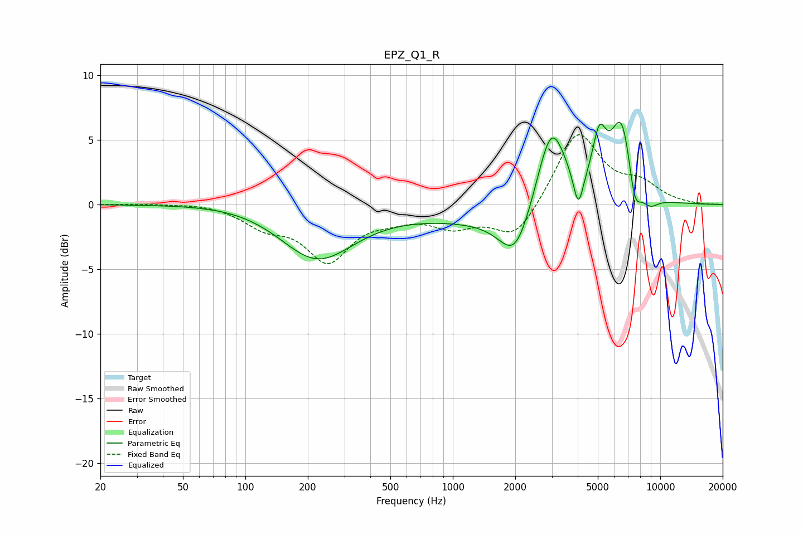

# EPZ_Q1_R
See [usage instructions](https://github.com/jaakkopasanen/AutoEq#usage) for more options and info.

### Parametric EQs
Apply preamp of -6.5 dB when using parametric equalizer.

|   # | Type    |   Fc (Hz) |    Q |   Gain (dB) |
|-----|---------|-----------|------|-------------|
|   1 | Peaking |       118 | 0.57 |         0.5 |
|   2 | Peaking |       220 | 0.78 |        -4.4 |
|   3 | Peaking |      1659 | 0.4  |        -1.2 |
|   4 | Peaking |      2002 | 1.82 |        -3.8 |
|   5 | Peaking |      2986 | 1.93 |         7   |
|   6 | Peaking |      4027 | 5.98 |        -2.8 |
|   7 | Peaking |      5086 | 4.19 |         3.8 |
|   8 | Peaking |      6536 | 2.41 |         6.8 |
|   9 | Peaking |      7511 | 4.3  |        -3.1 |
|  10 | Peaking |      8872 | 2.94 |        -1   |

### Fixed Band EQs
When using fixed band (also called graphic) equalizer, apply preamp of **-5.5 dB** (if available) and set gains manually with these parameters.

|   # | Type    |   Fc (Hz) |    Q |   Gain (dB) |
|-----|---------|-----------|------|-------------|
|   1 | Peaking |        31 | 1.41 |         0.1 |
|   2 | Peaking |        62 | 1.41 |         0.2 |
|   3 | Peaking |       125 | 1.41 |        -1.4 |
|   4 | Peaking |       250 | 1.41 |        -4.1 |
|   5 | Peaking |       500 | 1.41 |        -0.7 |
|   6 | Peaking |      1000 | 1.41 |        -1.5 |
|   7 | Peaking |      2000 | 1.41 |        -2.7 |
|   8 | Peaking |      4000 | 1.41 |         5.7 |
|   9 | Peaking |      8000 | 1.41 |         1.4 |
|  10 | Peaking |     16000 | 1.41 |        -0   |

### Graphs

