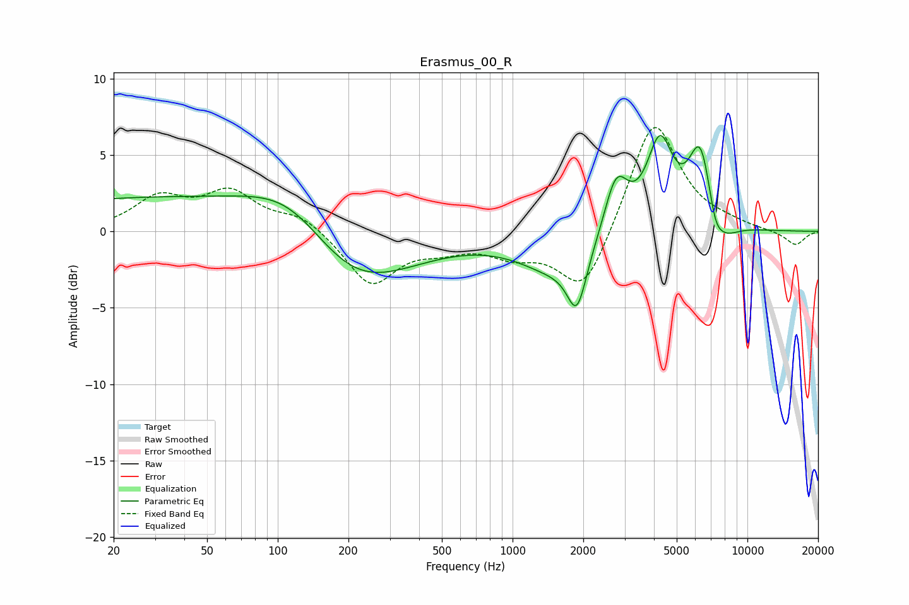

# Erasmus_00_R
See [usage instructions](https://github.com/jaakkopasanen/AutoEq#usage) for more options and info.

### Parametric EQs
Apply preamp of -6.4 dB when using parametric equalizer.

|   # | Type    |   Fc (Hz) |    Q |   Gain (dB) |
|-----|---------|-----------|------|-------------|
|   1 | Peaking |        34 | 0.18 |         2.2 |
|   2 | Peaking |       117 | 0.72 |         3.4 |
|   3 | Peaking |       195 | 0.56 |        -5.2 |
|   4 | Peaking |      1524 | 0.9  |        -2.4 |
|   5 | Peaking |      1880 | 3.45 |        -3.6 |
|   6 | Peaking |      2762 | 2.73 |         3.9 |
|   7 | Peaking |      4237 | 2.49 |         5.5 |
|   8 | Peaking |      6317 | 2.67 |         5.6 |
|   9 | Peaking |      7275 | 4.23 |        -1.6 |
|  10 | Peaking |      7936 | 2.17 |        -1.3 |

### Fixed Band EQs
When using fixed band (also called graphic) equalizer, apply preamp of **-6.9 dB** (if available) and set gains manually with these parameters.

|   # | Type    |   Fc (Hz) |    Q |   Gain (dB) |
|-----|---------|-----------|------|-------------|
|   1 | Peaking |        31 | 1.41 |         2.1 |
|   2 | Peaking |        62 | 1.41 |         2.4 |
|   3 | Peaking |       125 | 1.41 |         1   |
|   4 | Peaking |       250 | 1.41 |        -3.5 |
|   5 | Peaking |       500 | 1.41 |        -0.8 |
|   6 | Peaking |      1000 | 1.41 |        -1.3 |
|   7 | Peaking |      2000 | 1.41 |        -4.2 |
|   8 | Peaking |      4000 | 1.41 |         7.5 |
|   9 | Peaking |      8000 | 1.41 |         0.3 |
|  10 | Peaking |     16000 | 1.41 |        -0.9 |

### Graphs

