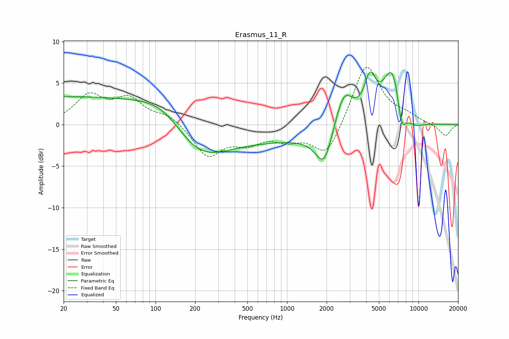

# Erasmus_11_R
See [usage instructions](https://github.com/jaakkopasanen/AutoEq#usage) for more options and info.

### Parametric EQs
Apply preamp of -6.4 dB when using parametric equalizer.

|   # | Type    |   Fc (Hz) |    Q |   Gain (dB) |
|-----|---------|-----------|------|-------------|
|   1 | Peaking |        20 | 0.18 |         3.3 |
|   2 | Peaking |       120 | 0.71 |         3   |
|   3 | Peaking |       202 | 0.69 |        -4.1 |
|   4 | Peaking |       791 | 0.19 |        -1.8 |
|   5 | Peaking |      1919 | 2.15 |        -4.4 |
|   6 | Peaking |      2699 | 1.92 |         5   |
|   7 | Peaking |      4270 | 3.14 |         4.5 |
|   8 | Peaking |      6393 | 1.77 |         7.7 |
|   9 | Peaking |      7421 | 3.71 |        -4.2 |
|  10 | Peaking |      9099 | 1.56 |        -1.3 |

### Fixed Band EQs
When using fixed band (also called graphic) equalizer, apply preamp of **-7.0 dB** (if available) and set gains manually with these parameters.

|   # | Type    |   Fc (Hz) |    Q |   Gain (dB) |
|-----|---------|-----------|------|-------------|
|   1 | Peaking |        31 | 1.41 |         3.3 |
|   2 | Peaking |        62 | 1.41 |         2.8 |
|   3 | Peaking |       125 | 1.41 |         1.1 |
|   4 | Peaking |       250 | 1.41 |        -3.8 |
|   5 | Peaking |       500 | 1.41 |        -1.8 |
|   6 | Peaking |      1000 | 1.41 |        -1.5 |
|   7 | Peaking |      2000 | 1.41 |        -4   |
|   8 | Peaking |      4000 | 1.41 |         7.5 |
|   9 | Peaking |      8000 | 1.41 |         0.8 |
|  10 | Peaking |     16000 | 1.41 |        -1.4 |

### Graphs

