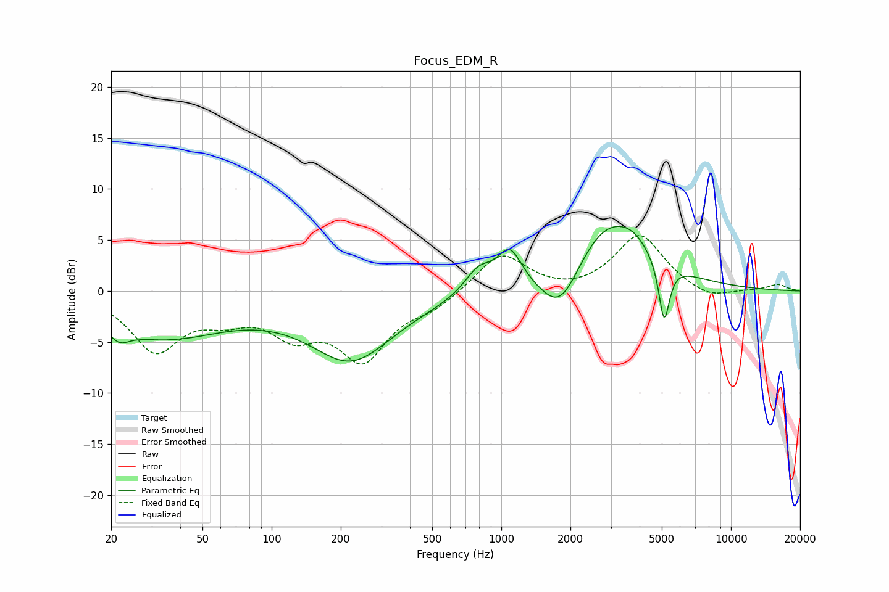

# Focus_EDM_R
See [usage instructions](https://github.com/jaakkopasanen/AutoEq#usage) for more options and info.

### Parametric EQs
Apply preamp of -6.4 dB when using parametric equalizer.

|   # | Type    |   Fc (Hz) |    Q |   Gain (dB) |
|-----|---------|-----------|------|-------------|
|   1 | Peaking |        22 | 3.33 |        -1.3 |
|   2 | Peaking |        33 | 0.51 |        -4.2 |
|   3 | Peaking |       222 | 0.79 |        -6   |
|   4 | Peaking |       241 | 0.21 |        -0.6 |
|   5 | Peaking |       795 | 2.28 |         2.3 |
|   6 | Peaking |      1088 | 2.65 |         3.7 |
|   7 | Peaking |      1812 | 1.57 |        -5.1 |
|   8 | Peaking |      2870 | 0.81 |         7.3 |
|   9 | Peaking |      3754 | 2.22 |         0.9 |
|  10 | Peaking |      5117 | 5.94 |        -6   |

### Fixed Band EQs
When using fixed band (also called graphic) equalizer, apply preamp of **-5.5 dB** (if available) and set gains manually with these parameters.

|   # | Type    |   Fc (Hz) |    Q |   Gain (dB) |
|-----|---------|-----------|------|-------------|
|   1 | Peaking |        31 | 1.41 |        -5.6 |
|   2 | Peaking |        62 | 1.41 |        -1.9 |
|   3 | Peaking |       125 | 1.41 |        -3.6 |
|   4 | Peaking |       250 | 1.41 |        -6.3 |
|   5 | Peaking |       500 | 1.41 |        -1.4 |
|   6 | Peaking |      1000 | 1.41 |         3.8 |
|   7 | Peaking |      2000 | 1.41 |        -0.3 |
|   8 | Peaking |      4000 | 1.41 |         5.5 |
|   9 | Peaking |      8000 | 1.41 |        -1   |
|  10 | Peaking |     16000 | 1.41 |         0.6 |

### Graphs

